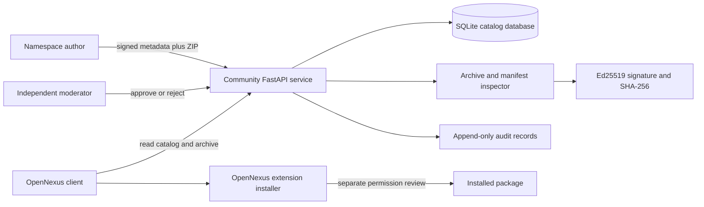
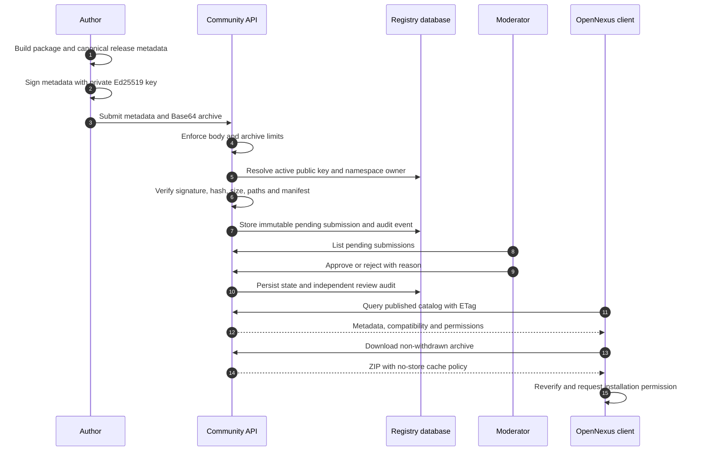
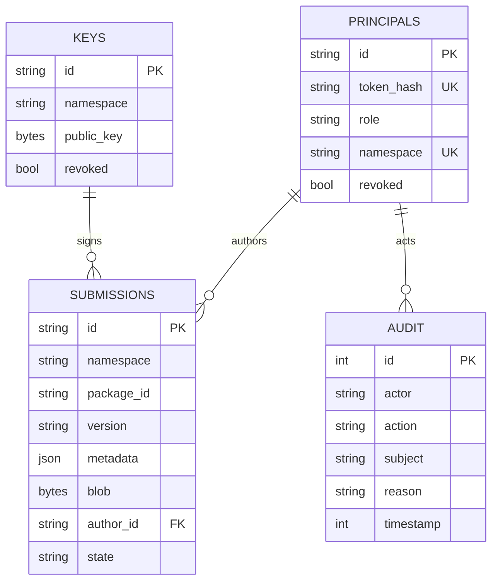

# Community for OpenNexus

[简体中文](README.zh-CN.md) | **English**

[](https://github.com/KiriAky107/Community-for-OpenNexus/releases/tag/v0.5.2-alpha1)


[](LICENSE)

Community for OpenNexus is an independent prototype catalog for publishing, signing, reviewing, discovering, withdrawing, and reporting OpenNexus extension packages. Supported package types are themes, Skills, Plugins, MCP configurations, personas, templates, and model installation profiles.

> This is an alpha engineering prototype, not a production marketplace. It stores package archives and catalog identities, but never user Vaults, model-provider credentials, private signing keys, or Sync Server sessions.

## Trust model and architecture



The catalog verifies publication integrity and moderation state. Installation remains a separate desktop-host trust decision: a published package is not automatically safe or authorized to run.

## Package publication flow



## Release lifecycle



```mermaid
stateDiagram-v2
    [*] --> pending: author submits unique version
    pending --> published: moderator approves
    pending --> rejected: moderator rejects
    published --> withdrawn: author or moderator withdraws
    published --> reported: authenticated user reports concern
    reported --> published: audit only; investigation continues
    published --> unavailable: signing key revoked
    withdrawn --> unavailable: archive download returns gone
    rejected --> [*]
    unavailable --> [*]
```

Versions are immutable by `(namespace, package_id, version)`. Withdrawal preserves metadata and audit history; it does not silently replace the archive with another build.

## Database model



The current schema version is `1`. Logical namespace and signer relations are verified in application transactions even where SQLite foreign keys are not declared.

## Package validation

Every release declares namespace, package ID, semantic version, type, author, license, SHA-256, size, platforms, architectures, compatible app versions, dependencies, permissions, changelog, signer key, and Ed25519 signature.

The inspector:

- rejects traversal, absolute/invalid Windows paths, duplicate case-folded names, symlinks, encryption, unsupported compression, excess entries, and zip bombs;
- verifies archive byte length and SHA-256 against signed canonical metadata;
- requires exactly one type-specific manifest;
- checks manifest identity, version, and permissions against signed metadata;
- rejects secrets or conversation history in JSON-based packages;
- never executes package code during submission review.

| Type | Required manifest |
| --- | --- |
| Theme | `theme.yaml` |
| Skill | `skill.yaml` |
| Plugin | `plugin.yaml` |
| MCP | `mcp.json` |
| Persona | `persona.json` |
| Template | `template.json` |
| Model profile | `model.json` |

## Development

```powershell
uv sync --frozen
uv run pytest
uv run python -m community serve
```

The development server binds to `127.0.0.1:8081`. Configure `COMMUNITY_DATABASE_PATH` to a managed location and `COMMUNITY_ALLOWED_ORIGINS` to an explicit comma-separated allowlist before deployment. Put any externally reachable instance behind TLS, authentication controls, rate limiting, monitoring, and backups.

## Administration

```powershell
uv run python -m community create-author --id AUTHOR_ID --namespace NAMESPACE --token-file C:/private/author.token
uv run python -m community create-moderator --id MODERATOR_ID --token-file C:/private/moderator.token
uv run python -m community add-key --id KEY_ID --namespace NAMESPACE --public-key-file C:/public/author-key.txt
```

Tokens are written only to a requested new file and are not printed. The service accepts Base64 Ed25519 public keys only and must never receive a private signing key. Protect token files with operating-system ACLs.

## API overview

| Route group | Access | Purpose |
| --- | --- | --- |
| `/health` | Public | Process health |
| `/catalog/v1/sources` | Public | Source identity and public keys |
| `/catalog/v1/packages` | Public | Searchable, paginated catalog with ETag |
| `/catalog/v1/releases/.../archive` | Public if active | Package archive download |
| `/catalog/v1/publish/submissions` | Author | Immutable namespace publication |
| `/catalog/v1/moderation/reviews` | Moderator | Independent review queue and decision |
| `/withdraw`, `/reports`, `/keys/.../revoke` | Authenticated role | Incident and lifecycle controls |

## Production gaps

The current bearer tokens do not expire. A production marketplace still requires account login, token rotation and revocation workflows, durable rate limiting, stronger moderator governance, availability monitoring, backup/restore procedures, abuse response, and a TLS reverse proxy. Do not present the prototype as a production marketplace.

## Security and community

- Never submit secrets, private keys, personal information, chat history, or user Vault content in a package.
- A package license must be explicit; `unknown`, `none`, `unlicensed`, and `tbd` are rejected.
- Reports and withdrawals require a reason and remain in the audit log.
- Vulnerabilities follow [SECURITY.md](SECURITY.md).
- Contributions follow [CONTRIBUTING.md](CONTRIBUTING.md) and the [Code of Conduct](CODE_OF_CONDUCT.md).
- Use repository Issue forms for catalog defects and package-policy proposals.

Related repositories: [OpenNexus](https://github.com/KiriAky107/OpenNexus) and [Sync for OpenNexus](https://github.com/KiriAky107/Sync-for-OpenNexus).

## License

This project is licensed under the [MIT License](LICENSE). Published packages and third-party components retain their own license terms.
