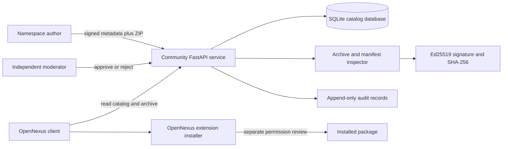
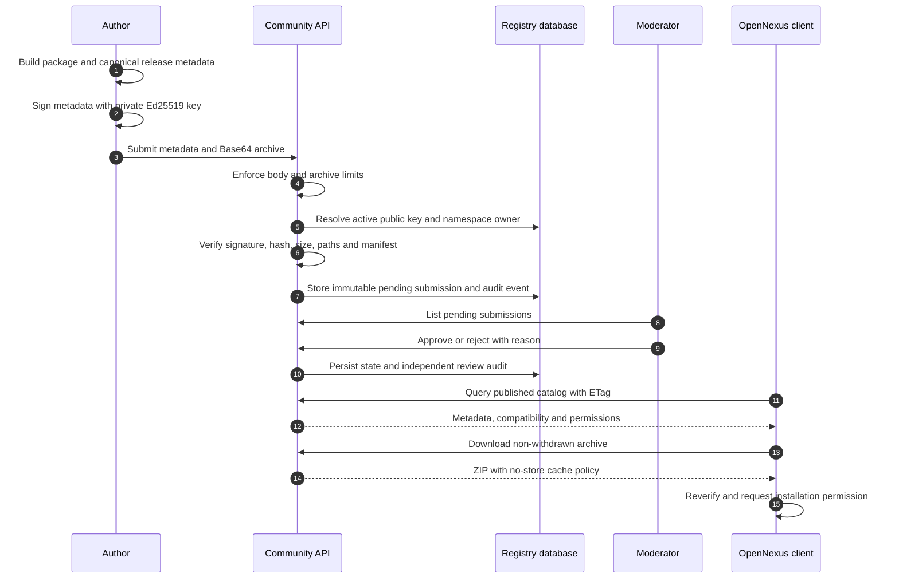
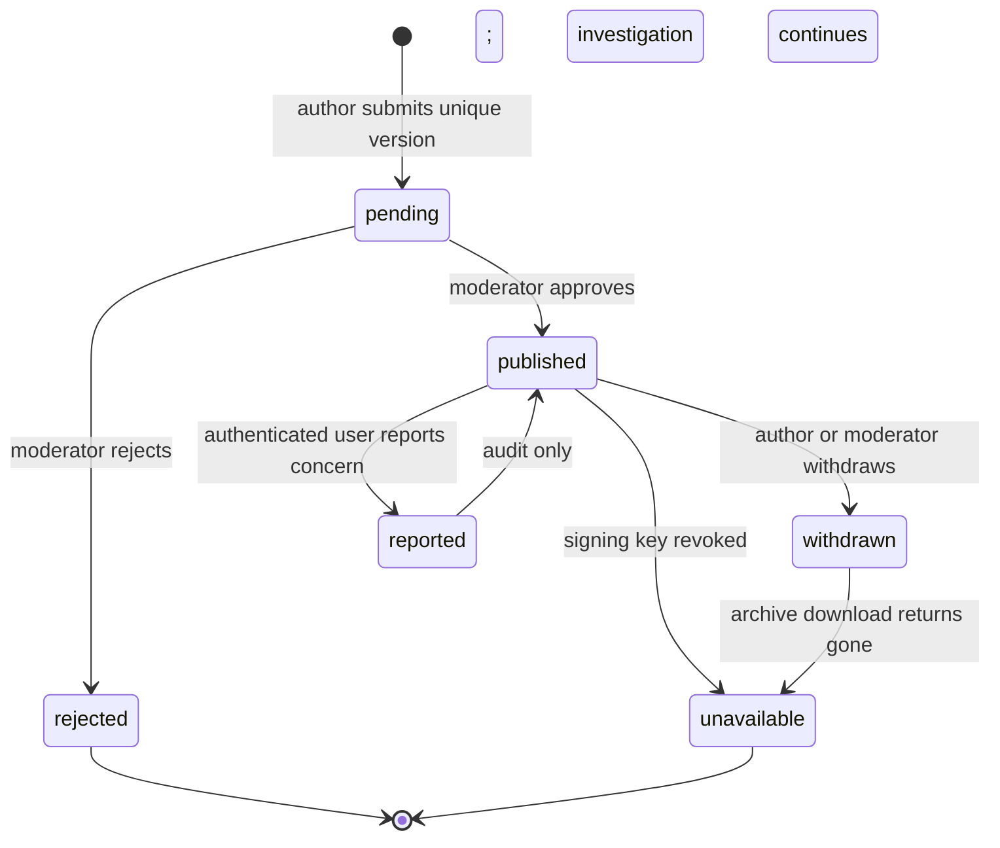
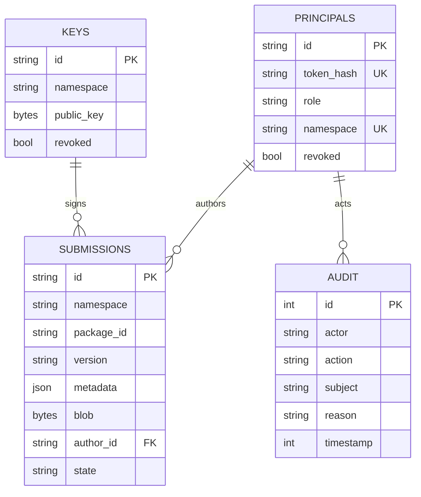

# Community for OpenNexus

[简体中文](README.zh-CN.md) | **English**

[](https://github.com/KiriAky107/Community-for-OpenNexus/releases/tag/v0.5.2-alpha1)


[](LICENSE)

Community for OpenNexus is an independent prototype catalog for publishing, signing, reviewing, discovering, withdrawing, and reporting OpenNexus extension packages. Supported package types are themes, Skills, Plugins, MCP configurations, personas, templates, and model installation profiles.

> This is an alpha engineering prototype, not a production marketplace. It stores package archives and catalog identities, but never user Vaults, model-provider credentials, private signing keys, or Sync Server sessions.

## Trust model and architecture


```mermaid
flowchart LR
    Author[Namespace author] -->|signed metadata plus ZIP| API[Community FastAPI service]
    Moderator[Independent moderator] -->|approve or reject| API
    Client[OpenNexus client] -->|read catalog and archive| API
    API --> DB[(SQLite catalog database)]
    API --> Inspect[Archive and manifest inspector]
    Inspect --> Verify[Ed25519 signature and SHA-256]
    API --> Audit[Append-only audit records]
    Client --> Host[OpenNexus extension installer]
    Host -->|separate permission review| Active[Installed package]
```

The catalog verifies publication integrity and moderation state. Installation remains a separate desktop-host trust decision: a published package is not automatically safe or authorized to run.

## Package publication flow


```mermaid
sequenceDiagram
    autonumber
    participant Author
    participant Catalog as Community API
    participant DB as Registry database
    participant Moderator
    participant Client as OpenNexus client

    Author->>Author: Build package and canonical release metadata
    Author->>Author: Sign metadata with private Ed25519 key
    Author->>Catalog: Submit metadata and Base64 archive
    Catalog->>Catalog: Enforce body and archive limits
    Catalog->>DB: Resolve active public key and namespace owner
    Catalog->>Catalog: Verify signature, hash, size, paths and manifest
    Catalog->>DB: Store immutable pending submission and audit event
    Moderator->>Catalog: List pending submissions
    Moderator->>Catalog: Approve or reject with reason
    Catalog->>DB: Persist state and independent review audit
    Client->>Catalog: Query published catalog with ETag
    Catalog-->>Client: Metadata, compatibility and permissions
    Client->>Catalog: Download non-withdrawn archive
    Catalog-->>Client: ZIP with no-store cache policy
    Client->>Client: Reverify and request installation permission
```

## Release lifecycle


```mermaid
stateDiagram-v2
    [*] --> pending: author submits unique version
    pending --> published: moderator approves
    pending --> rejected: moderator rejects
    published --> withdrawn: author or moderator withdraws
    published --> reported: authenticated user reports concern
    reported --> published: audit only; investigation continues
    published --> unavailable: signing key revoked
    withdrawn --> unavailable: archive download returns gone
    rejected --> [*]
    unavailable --> [*]
```

Versions are immutable by `(namespace, package_id, version)`. Withdrawal preserves metadata and audit history; it does not silently replace the archive with another build.

## Database model


```mermaid
erDiagram
    PRINCIPALS ||--o{ SUBMISSIONS : authors
    PRINCIPALS ||--o{ AUDIT : acts
    KEYS ||--o{ SUBMISSIONS : signs

    PRINCIPALS {
        string id PK
        string token_hash UK
        string role
        string namespace UK
        bool revoked
    }
    KEYS {
        string id PK
        string namespace
        bytes public_key
        bool revoked
    }
    SUBMISSIONS {
        string id PK
        string namespace
        string package_id
        string version
        json metadata
        bytes blob
        string author_id FK
        string state
    }
    AUDIT {
        int id PK
        string actor
        string action
        string subject
        string reason
        int timestamp
    }
```

The current schema version is `1`. Logical namespace and signer relations are verified in application transactions even where SQLite foreign keys are not declared.

## Package validation

Every release declares namespace, package ID, semantic version, type, author, license, SHA-256, size, platforms, architectures, compatible app versions, dependencies, permissions, changelog, signer key, and Ed25519 signature.

The inspector:

- rejects traversal, absolute/invalid Windows paths, duplicate case-folded names, symlinks, encryption, unsupported compression, excess entries, and zip bombs;
- verifies archive byte length and SHA-256 against signed canonical metadata;
- requires exactly one type-specific manifest;
- checks manifest identity, version, and permissions against signed metadata;
- rejects secrets or conversation history in JSON-based packages;
- never executes package code during submission review.

| Type | Required manifest |
| --- | --- |
| Theme | `theme.yaml` |
| Skill | `skill.yaml` |
| Plugin | `plugin.yaml` |
| MCP | `mcp.json` |
| Persona | `persona.json` |
| Template | `template.json` |
| Model profile | `model.json` |

MCP arguments must be strings. Use `secret_environment_keys` or `secret_header_keys` to declare credentials; plain token and authorization values are rejected. Packages cannot supply enabled, trust, test or target-version state. Applying a reviewed MCP configuration in the desktop leaves it disabled until the user reviews, tests and enables it separately.

Model plans require nonempty `source`, `revision`, `license`, a resource object and a list of verified platforms. A plan for the desktop's local embedding runtime adds `model_key` and a `runtime_config` whose `embedding_model` matches that key. CPU threads, memory and timeout values are bounded integers. The desktop checks the model's exact pinned repository, revision and license before applying settings. Weight installation and reindexing remain explicit actions. [Executable configuration examples](tests/fixtures/community-v1-configurations.json) are shared with the desktop and checked in CI; metadata-only plans remain readable.

## Development

```powershell
uv sync --frozen
uv run pytest
uv run python -m community serve
```

The development server binds to `127.0.0.1:8081`. Configure `COMMUNITY_DATABASE_PATH` to a managed location and `COMMUNITY_ALLOWED_ORIGINS` to an explicit comma-separated allowlist before deployment. Put any externally reachable instance behind TLS, authentication controls, rate limiting, monitoring, and backups.

## Administration

```powershell
uv run python -m community create-author --id AUTHOR_ID --namespace NAMESPACE --token-file C:/private/author.token
uv run python -m community create-moderator --id MODERATOR_ID --token-file C:/private/moderator.token
uv run python -m community add-key --id KEY_ID --namespace NAMESPACE --public-key-file C:/public/author-key.txt
```

Tokens are written only to a requested new file and are not printed. The service accepts Base64 Ed25519 public keys only and must never receive a private signing key. Protect token files with operating-system ACLs.

Authors and moderators can use the same CLI against an HTTPS catalog. `COMMUNITY_URL` supplies its base URL; `--token-file` reads the existing role token. Every mutation is an explicit command. Package checks verify the archive and signed metadata before submission.

```powershell
uv run python -m community check-package --release-file release.json --archive-file package.zip --public-key-file author-key.txt
uv run python -m community submit --release-file release.json --archive-file package.zip --public-key-file author-key.txt --token-file author.token
uv run python -m community submissions --package-id PACKAGE_ID --version VERSION --token-file author.token
uv run python -m community reviews --offset 0 --limit 30 --token-file moderator.token
uv run python -m community review --submission-id SUBMISSION_ID --approve --reason "Reviewed package and permissions" --token-file moderator.token
uv run python -m community reports --token-file moderator.token
uv run python -m community resolve-report --report-id REPORT_ID --decision addressed --reason "Recorded resolution" --token-file moderator.token
uv run python -m community audit --after 0 --limit 30 --token-file moderator.token
```

Use `--reject` for rejection, `withdraw --release-id ID --reason TEXT` for withdrawal, `report --release-id ID --reason TEXT` for a report, and `revoke-key --key-id ID --reason TEXT` for key revocation. `status --submission-id ID` returns the authorized current state. Pages and audit cursors bound each response. Reports retain their original audit entry after resolution. An interrupted mutation exits with code 3 and `OUTCOME_UNKNOWN`; it is never automatically sent again. Inspect `submissions` or the current status before deciding what to do next. Redirects are refused. Loopback HTTP fixtures require the explicit `--allow-loopback-http` option.

## Readiness, backup and recovery

`/health` checks the process; `/ready` checks the existing database schema, access and write transaction availability without changing rows. It returns 503 when the database is unavailable. [The systemd unit](deployment/opennexus-community.service) and [environment example](deployment/community.env.example) use an unprivileged service account, a private data directory and a loopback listener. Install the checkout at `/opt/opennexus-community`, create the `opennexus-community` account, and place the reviewed environment file at `/etc/opennexus-community.env`. Install frozen dependencies with `uv sync --frozen --python /usr/bin/python3 --no-managed-python`, using a system Python 3.12 or later, so the protected home directory is not needed by the interpreter. An external TLS reverse proxy remains the operator's deployment responsibility.

```powershell
uv run python -m community backup --output-dir C:/private/catalog-backup
uv run python -m community verify-backup --input-dir C:/private/catalog-backup --expected-sha256 RECORDED_SHA256
uv run python -m community restore --input-dir C:/private/catalog-backup --output C:/private/restored-catalog.sqlite3 --expected-sha256 RECORDED_SHA256
```

Backups use SQLite's online snapshot API, including committed WAL data. The completion manifest records the database hash, row counts and signed archive checks. Preserve the returned hash separately. Verification checks the SQLite structure, metadata signatures and archive digests, retaining revoked keys, withdrawn releases, old signed versions and audit records. Interrupted bundles without a complete manifest fail verification. Restore writes a verified snapshot to a new output path and keeps account and release states intact. Backups contain account token hashes and must be protected by operating-system permissions. After verifying the restored database, stop the service and explicitly select that database in its environment configuration before restarting it.

## API overview

| Route group | Access | Purpose |
| --- | --- | --- |
| `/health` | Public | Process health |
| `/ready` | Public | Database readiness |
| `/catalog/v1/sources` | Public | Source identity and public keys |
| `/catalog/v1/packages` | Public | Searchable, paginated catalog with ETag |
| `/catalog/v1/releases/.../archive` | Public if active | Package archive download |
| `/catalog/v1/publish/submissions` | Author | Immutable namespace publication |
| `/catalog/v1/moderation/reviews` | Moderator | Independent review queue and decision |
| `/catalog/v1/publish/submissions/...` | Owner or moderator | Publication state and reply recovery |
| `/catalog/v1/moderation/audit`, `/reports/...` | Moderator | Paged audit, reports and reasoned resolution |
| `/withdraw`, `/reports`, `/keys/.../revoke` | Authenticated role | Incident and lifecycle controls |

## Production gaps

The current bearer tokens do not expire. A production marketplace still requires account login, token rotation and revocation workflows, durable rate limiting, stronger moderator governance, availability monitoring, abuse response, and a TLS reverse proxy. Do not present the prototype as a production marketplace.

## Security and community

- Never submit secrets, private keys, personal information, chat history, or user Vault content in a package.
- A package license must be explicit; `unknown`, `none`, `unlicensed`, and `tbd` are rejected.
- Reports and withdrawals require a reason and remain in the audit log.
- Vulnerabilities follow [SECURITY.md](SECURITY.md).
- Contributions follow [CONTRIBUTING.md](CONTRIBUTING.md) and the [Code of Conduct](CODE_OF_CONDUCT.md).
- Use repository Issue forms for catalog defects and package-policy proposals.

Related repositories: [OpenNexus](https://github.com/KiriAky107/OpenNexus) and [Sync for OpenNexus](https://github.com/KiriAky107/Sync-for-OpenNexus).

## License

This project is licensed under the [MIT License](LICENSE). Published packages and third-party components retain their own license terms.
