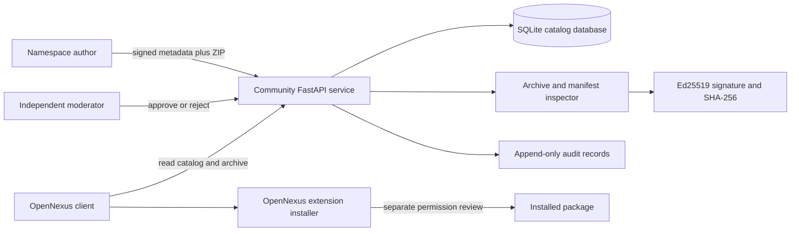
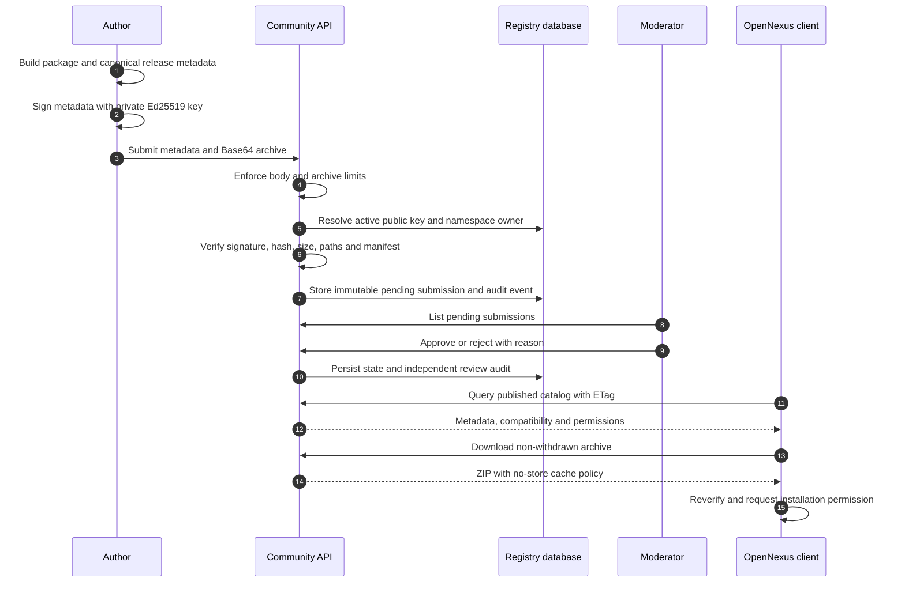
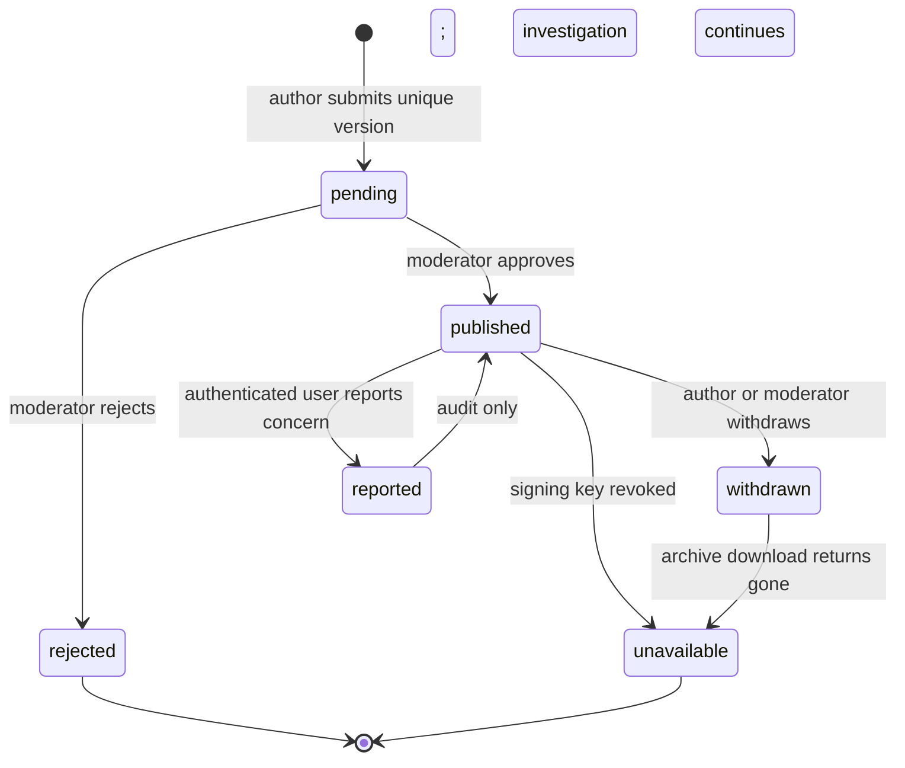
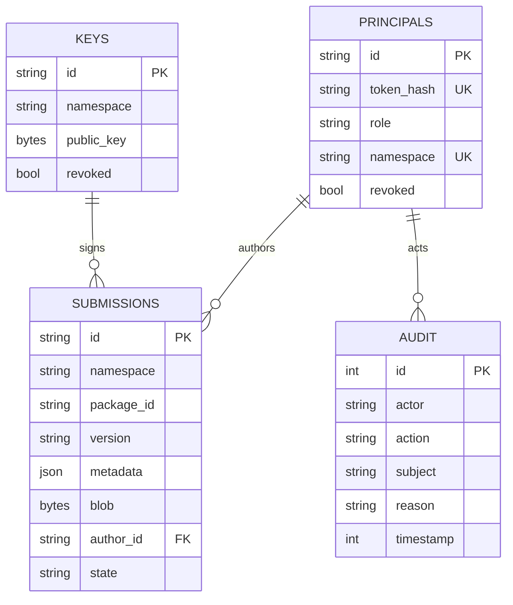

<div align="center">

  

  <h1>Community for OpenNexus</h1>

  <p><strong>A Signed Extension Catalog for OpenNexus</strong></p>

  <p>Discover OpenNexus extensions, inspect their permissions and sources, and publish signed packages through independent review.</p>

  <p>
    <a href="README.zh-CN.md">简体中文</a> • <a href="#quick-start">Quick Start</a> • <a href="#highlights">Highlights</a> • <a href="#architecture">Architecture</a> • <a href="#development">Development</a> • <a href="https://github.com/KiriAky107/Community-for-OpenNexus/releases">Releases</a>
  </p>

  <p>
    <a href="https://github.com/KiriAky107/Community-for-OpenNexus/releases/tag/v0.6.0"></a> <a href="https://github.com/KiriAky107/Community-for-OpenNexus/actions/workflows/ci.yml"></a>     <a href="LICENSE"></a>
  </p>

</div>

---

Current release: [v0.6.0](https://github.com/KiriAky107/Community-for-OpenNexus/releases/tag/v0.6.0).

Current development adds a public web catalog at `/` and an author and moderator workbench at `/workbench`. The catalog offers shareable package details, version history, search and type filters. The workbench checks signed uploads, shows actual files and previous-version changes, and reconciles interrupted writes by their original operation IDs. Browser downloads recheck release and signing-key state, validate size and SHA-256, and provide an explicit save link.

## What’s New in 0.6.0

- Filter, count and paginate catalogs in database queries, with semantic version ordering and query-specific ETags.
- Pair with desktop pagination, installed-version comparison and reviewed updates, including source, permissions, dependency and compatibility checks.
- Personas, experiment templates, MCP configurations and model profiles use shared declarative contracts. Templates preserve actual source and input extensions.
- Author and moderator CLIs validate submissions, require independent review and handle withdrawal, reports and cursor-based audit records while keeping releases immutable.
- Provide readiness checks, online SQLite snapshots, digest and signature verification, and restoration into a new target. GitHub CI verifies deployment packages and fixed source archives.

## Highlights

- **Discover extensions**: Search and paginate a versioned catalog of themes, Skills, Plugins, MCP configurations, personas, templates and model profiles.
- **Inspect before installing**: Review authors, compatibility, dependencies, permissions and signed archive metadata before the desktop asks for installation approval.
- **Author-owned signatures**: Sign with a local Ed25519 private key. The catalog receives the public key, signed metadata and archive, and verifies their integrity.
- **Independent review**: Submit a unique version, inspect its status, and have a separate moderator approve or reject it with a recorded reason.
- **Traceable package states**: Preserve immutable versions and audit records across reporting, withdrawal and signing-key revocation.
- **Recoverable catalog data**: Check readiness, take online SQLite snapshots and verify signatures and hashes before restoring to a new target.

## Quick Start

```powershell
uv sync --frozen
uv run python -m community serve
```

The development server binds to `127.0.0.1:8081`. Configure `COMMUNITY_DATABASE_PATH` to a managed location and `COMMUNITY_ALLOWED_ORIGINS` to an explicit comma-separated allowlist before deployment. Put any externally reachable instance behind TLS, authentication controls, rate limiting, monitoring, and backups.

Open `http://127.0.0.1:8081/` to browse the web catalog. The checked-in web build is served by the same process; no Node.js process is needed at runtime. Check `/health`, `/ready` and `/catalog/v1/packages`, then configure OpenNexus to use the catalog URL. Create author and moderator identities only if you need to publish; see [Administration](#administration).

## Core Workflows

### 1. Find and install a package

Search the website by name or description, choose a package type, and open a release. Share `/packages/{namespace}/{package_id}?version={version}` to link directly to that version. Review its author, license, compatibility, dependencies, permissions and original changelog. Choose **Download archive**, then **Save verified ZIP** after the size and hash check. Withdrawn releases and revoked or missing signing keys disable downloads; signing-key status is refreshed independently of catalog ETags. Cached results are limited to matching queries in the current browser session and show their last confirmation time.

In OpenNexus, compare installed and available versions before installation. The desktop verifies the package's cryptographic signature and asks for installation approval; the website's hash check does not grant execution permissions.

### 2. Publish and review a signed version

Prepare the manifest and ZIP, sign canonical release metadata locally, and run `check-package`. Submit with the author's token, then use a separate moderator identity to inspect and decide the submission. See [Administration](#administration) for the current CLI commands.

With `COMMUNITY_WEB_ORIGIN` configured, open **Author and moderation** at `/workbench` and log in with the existing role token. The password field is cleared before sending; identity and CSRF proof remain in memory, and the server sets an expiring HttpOnly cookie. Authors choose the signed release JSON and original ZIP, run the read-only preflight, review license, permissions, signature, manifest and actual file hashes, then confirm submission. Submission status and rejection reasons are paged. Metadata is limited to 1 MiB and ZIPs to 10 MiB.

Moderators use their own session to review pending submissions, compare metadata, permissions and file changes against the previous publication, and approve or reject with a reason. File and difference pages contain at most 100 entries. Manifests display at most 64 KiB and explicitly indicate truncation; **Save verified ZIP** provides the original archive for full inspection. Package text is rendered literally and never executed.

### 3. Handle an update or incident

Publish an update as a new immutable version. In the workbench, report a published release with a reason; moderators inspect the reported package and confirm a resolution or withdrawal. Authors can also withdraw their own published releases. Revoked signatures and withdrawn archives become unavailable.

Each confirmed workbench action freezes its content and operation ID. An unconfirmed result locks resource and identity switching: choose **Query original operation** first. An existing receipt confirms the original action; a missing receipt enables an explicit retry with the same ID and content. Writes are never retried automatically. If the session expires, old package data is cleared and only the receipt reference remains; sign in as the original identity to query it. Missing receipts after expiry require the original content and ID to be reconciled by an administrator. **My sessions** lists only your active browser sessions and lets you revoke one, including the current session.

### 4. Back up the catalog

Create an online snapshot, preserve its recorded hash separately, and verify it before restoring to a new database path. Select the restored database only after checking the result; see [Backup and Recovery](#backup-and-recovery).

## Architecture


```mermaid
flowchart LR
    Author[Namespace author] -->|signed metadata plus ZIP| API[Community FastAPI service]
    Moderator[Independent moderator] -->|approve or reject| API
    Client[OpenNexus client] -->|read catalog and archive| API
    API --> DB[(SQLite catalog database)]
    API --> Inspect[Archive and manifest inspector]
    Inspect --> Verify[Ed25519 signature and SHA-256]
    API --> Audit[Append-only audit records]
    Client --> Host[OpenNexus extension installer]
    Host -->|separate permission review| Active[Installed package]
```

The catalog verifies publication integrity and moderation state. Installation remains a separate desktop-host trust decision: a published package is not automatically safe or authorized to run.

## Package Publication Flow


```mermaid
sequenceDiagram
    autonumber
    participant Author
    participant Catalog as Community API
    participant DB as Registry database
    participant Moderator
    participant Client as OpenNexus client

    Author->>Author: Build package and canonical release metadata
    Author->>Author: Sign metadata with private Ed25519 key
    Author->>Catalog: Submit metadata and Base64 archive
    Catalog->>Catalog: Enforce body and archive limits
    Catalog->>DB: Resolve active public key and namespace owner
    Catalog->>Catalog: Verify signature, hash, size, paths and manifest
    Catalog->>DB: Store immutable pending submission and audit event
    Moderator->>Catalog: List pending submissions
    Moderator->>Catalog: Approve or reject with reason
    Catalog->>DB: Persist state and independent review audit
    Client->>Catalog: Query published catalog with ETag
    Catalog-->>Client: Metadata, compatibility and permissions
    Client->>Catalog: Download non-withdrawn archive
    Catalog-->>Client: ZIP with no-store cache policy
    Client->>Client: Reverify and request installation permission
```

## Release Lifecycle


```mermaid
stateDiagram-v2
    [*] --> pending: author submits unique version
    pending --> published: moderator approves
    pending --> rejected: moderator rejects
    published --> withdrawn: author or moderator withdraws
    published --> reported: authenticated user reports concern
    reported --> published: audit only; investigation continues
    published --> unavailable: signing key revoked
    withdrawn --> unavailable: archive download returns gone
    rejected --> [*]
    unavailable --> [*]
```

Versions are immutable by `(namespace, package_id, version)`. Withdrawal preserves metadata and audit history; it does not silently replace the archive with another build.

## Database Model


```mermaid
erDiagram
    PRINCIPALS ||--o{ SUBMISSIONS : authors
    PRINCIPALS ||--o{ AUDIT : acts
    KEYS ||--o{ SUBMISSIONS : signs

    PRINCIPALS {
        string id PK
        string token_hash UK
        string role
        string namespace UK
        bool revoked
    }
    KEYS {
        string id PK
        string namespace
        bytes public_key
        bool revoked
    }
    SUBMISSIONS {
        string id PK
        string namespace
        string package_id
        string version
        json metadata
        bytes blob
        string author_id FK
        string state
    }
    AUDIT {
        int id PK
        string actor
        string action
        string subject
        string reason
        int timestamp
    }
```

The current schema version is `1`. Logical namespace and signer relations are verified in application transactions even where SQLite foreign keys are not declared.

## Package Validation

Every release declares namespace, package ID, semantic version, type, author, license, SHA-256, size, platforms, architectures, compatible app versions, dependencies, permissions, changelog, signer key, and Ed25519 signature.

The inspector:

- rejects traversal, absolute/invalid Windows paths, duplicate case-folded names, symlinks, encryption, unsupported compression, excess entries, and zip bombs;
- verifies archive byte length and SHA-256 against signed canonical metadata;
- requires exactly one type-specific manifest;
- checks manifest identity, version, and permissions against signed metadata;
- rejects secrets or conversation history in JSON-based packages;
- never executes package code during submission review.

| Type | Required manifest |
| --- | --- |
| Theme | `theme.yaml` |
| Skill | `skill.yaml` |
| Plugin | `plugin.yaml` |
| MCP | `mcp.json` |
| Persona | `persona.json` |
| Template | `template.json` |
| Model profile | `model.json` |

MCP arguments must be strings. Use `secret_environment_keys` or `secret_header_keys` to declare credentials; plain token and authorization values are rejected. Packages cannot supply enabled, trust, test or target-version state. Applying a reviewed MCP configuration in the desktop leaves it disabled until the user reviews, tests and enables it separately.

Model plans require nonempty `source`, `revision`, `license`, a resource object and a list of verified platforms. A plan for the desktop's local embedding runtime adds `model_key` and a `runtime_config` whose `embedding_model` matches that key. CPU threads, memory and timeout values are bounded integers. The desktop checks the model's exact pinned repository, revision and license before applying settings. Weight installation and reindexing remain explicit actions. [Executable configuration examples](tests/fixtures/community-v1-configurations.json) are shared with the desktop and checked in CI; metadata-only plans remain readable.

## Ecosystem Repositories

| Repository | Role |
| --- | --- |
| [OpenNexus](https://github.com/KiriAky107/OpenNexus) | Local vault editing, AI workflows and reviewed extension installation |
| [Sync for OpenNexus](https://github.com/KiriAky107/Sync-for-OpenNexus) | Optional self-hosted vault synchronization and recovery |
| [Community for OpenNexus](https://github.com/KiriAky107/Community-for-OpenNexus) | Independent signed package catalog and publication review |

The services are optional and separately deployed. Sync uses `/sync/v1`; Community uses `/catalog/v1`. Product versions and protocol versions are maintained separately.

## Administration

```powershell
uv run python -m community create-author --id AUTHOR_ID --namespace NAMESPACE --token-file C:/private/author.token
uv run python -m community create-moderator --id MODERATOR_ID --token-file C:/private/moderator.token
uv run python -m community add-key --id KEY_ID --namespace NAMESPACE --public-key-file C:/public/author-key.txt
```

Tokens are written only to a requested new file and are not printed. The service accepts Base64 Ed25519 public keys only and must never receive a private signing key. Protect token files with operating-system ACLs.

Authors and moderators can use the same CLI against an HTTPS catalog. `COMMUNITY_URL` supplies its base URL; `--token-file` reads the existing role token. Every mutation is an explicit command. Package checks verify the archive and signed metadata before submission.

```powershell
uv run python -m community check-package --release-file release.json --archive-file package.zip --public-key-file author-key.txt
uv run python -m community submit --release-file release.json --archive-file package.zip --public-key-file author-key.txt --token-file author.token
uv run python -m community submissions --package-id PACKAGE_ID --version VERSION --token-file author.token
uv run python -m community reviews --offset 0 --limit 30 --token-file moderator.token
uv run python -m community review --submission-id SUBMISSION_ID --approve --reason "Reviewed package and permissions" --token-file moderator.token
uv run python -m community reports --token-file moderator.token
uv run python -m community resolve-report --report-id REPORT_ID --decision addressed --reason "Recorded resolution" --token-file moderator.token
uv run python -m community audit --after 0 --limit 30 --token-file moderator.token
```

Use `--reject` for rejection, `withdraw --release-id ID --reason TEXT` for withdrawal, `report --release-id ID --reason TEXT` for a report, and `revoke-key --key-id ID --reason TEXT` for key revocation. `status --submission-id ID` returns the authorized current state. Pages and audit cursors bound each response. Reports retain their original audit entry after resolution. An interrupted mutation exits with code 3 and `OUTCOME_UNKNOWN`; it is never automatically sent again. Inspect `submissions` or the current status before deciding what to do next. Redirects are refused. Loopback HTTP fixtures require the explicit `--allow-loopback-http` option.

### Browser session API

Set `COMMUNITY_WEB_ORIGIN` to the exact public HTTPS origin, such as `https://community.example.org`. The TLS proxy must preserve that host. The session API exchanges an existing author or moderator token for a `Secure`, `HttpOnly`, `SameSite=Strict` cookie. It does not return or persist the original token. `COMMUNITY_WEB_SESSION_TTL` sets an absolute lifetime in seconds: 7,200 by default, between 300 and 86,400. Reads do not extend it. Each identity can have eight active sessions; login allows ten attempts per minute per client address in each server process. Keep external rate limiting at the proxy.

`POST /catalog/v1/web/session` accepts `{ "token": "ROLE_TOKEN" }`. Its response and the read-only `GET` at the same route include the current role, namespace, session ID, expiry and a CSRF proof. Cookie-authenticated writes must send that proof as `X-Community-CSRF` and the exact same-origin `Origin`; cross-site and same-site sibling requests are refused. CLI bearer authentication remains available, but a request cannot combine it with a browser cookie. Role changes and principal revocation take effect on the next request.

`GET /catalog/v1/web/sessions` lists only the current identity's active sessions. `POST /catalog/v1/web/sessions/{session_id}/revoke` removes an owned session; repeat revocation is safe. `POST /catalog/v1/web/session/logout` removes the current session and clears its cookie. The `/workbench` page uses these routes without storing tokens or CSRF proofs in URLs or browser storage. The public catalog remains usable without login.

Authors can send signed metadata and the Base64 ZIP to `POST /catalog/v1/publish/preflight` before committing a submission. It checks ownership, the current signing key, signature, actual archive bytes and immutable version without writing a submission or audit entry. The response includes a `review_digest`. Authorized `GET /catalog/v1/publish/submissions/{id}/inspection?offset=0&limit=100` returns actual file sizes and hashes, the manifest, permissions and dependencies, decisions and changes from the preceding published version. File and change lists are paged; a manifest preview beyond 64 KiB is explicitly marked as truncated. The authorized `/archive` route downloads the original ZIP for full inspection without executing it.

Cookie-authenticated mutations require a fresh 32-character lowercase hexadecimal `operation_id`. Submission, review, withdrawal and report resolution also require `expected_sha256`: the reviewed release digest, or the report's `review_digest` from the report queue. An outdated digest refuses the action. The server rechecks the signer and archive on approval and forbids self-review. Authors can read their rejection and withdrawal reasons through submission status.

After an interrupted write, read `GET /catalog/v1/web/operations/{operation_id}`. It returns only the current identity's immutable receipt or `state: "not_found"`. A confirmed receipt keeps its original result; an explicit retry with the same ID and exact payload cannot append another submission, decision or report. Reusing an ID for a different intent is refused. When the receipt is absent, review the original intent before explicitly resending it. Bearer clients may also supply these operation fields; existing CLI commands retain their explicit, unretried behavior.

For an isolated HTTP demonstration, set `COMMUNITY_WEB_ORIGIN=http://127.0.0.1:8081` and run `uv run python -m community serve --allow-insecure-loopback-sessions`. The exception accepts only a loopback origin and listener. Public deployments use HTTPS and the default secure cookie policy.

## Backup and Recovery

`/health` checks the process; `/ready` checks the existing database schema, access and write transaction availability without changing rows. It returns 503 when the database is unavailable. [The systemd unit](deployment/opennexus-community.service) and [environment example](deployment/community.env.example) use an unprivileged service account, a private data directory and a loopback listener. Install the checkout at `/opt/opennexus-community`, create the `opennexus-community` account, and place the reviewed environment file at `/etc/opennexus-community.env`. Install frozen dependencies with `uv sync --frozen --python /usr/bin/python3 --no-managed-python`, using a system Python 3.12 or later, so the protected home directory is not needed by the interpreter. An external TLS reverse proxy remains the operator's deployment responsibility.

```powershell
uv run python -m community backup --output-dir C:/private/catalog-backup
uv run python -m community verify-backup --input-dir C:/private/catalog-backup --expected-sha256 RECORDED_SHA256
uv run python -m community restore --input-dir C:/private/catalog-backup --output C:/private/restored-catalog.sqlite3 --expected-sha256 RECORDED_SHA256
```

Backups use SQLite's online snapshot API, including committed WAL data. The completion manifest records the database hash, row counts and signed archive checks. Preserve the returned hash separately. Verification checks the SQLite structure, metadata signatures and archive digests, retaining revoked keys, withdrawn releases, old signed versions and audit records. Interrupted bundles without a complete manifest fail verification. Restore writes a verified snapshot to a new output path and keeps account and release states intact. Backups contain account token hashes and must be protected by operating-system permissions. After verifying the restored database, stop the service and explicitly select that database in its environment configuration before restarting it.

The owned backup snapshot excludes short-lived browser sessions, without signing users out of the running source service. Verification refuses a backup containing active session rows. After restoration, browser users log in again; original principal tokens and signed package history remain intact. Backups made before the session table existed still verify and restore, and starting the service adds the empty table.

Immutable action receipts remain in the audit history and are checked during backup verification. Recovery retains their original IDs and outcomes, so retrying an already confirmed operation against the restored catalog returns its receipt.

## API Overview

| Route group | Access | Purpose |
| --- | --- | --- |
| `/`, `/packages/{namespace}/{package_id}` | Public | Web catalog and shareable version details |
| `/health` | Public | Process health |
| `/ready` | Public | Database readiness |
| `/catalog/v1/sources` | Public | Source identity and public keys |
| `/catalog/v1/packages` | Public | Searchable, paginated catalog with ETag |
| `/catalog/v1/releases/.../archive` | Public if active | Package archive download |
| `/catalog/v1/web/session`, `/web/sessions/...` | Same-origin author or moderator | Expiring browser session, owned revocation and logout |
| `/catalog/v1/web/operations/{operation_id}` | Current identity | Read-only reconciliation of an immutable action receipt |
| `/catalog/v1/publish/preflight` | Author | Read-only signed archive and version checks |
| `/catalog/v1/publish/submissions/.../inspection`, `/archive` | Owner or moderator | Paged file and version inspection, original ZIP |
| `/catalog/v1/publish/submissions` | Author | Immutable namespace publication |
| `/catalog/v1/moderation/reviews` | Moderator | Independent review queue and decision |
| `/catalog/v1/publish/submissions/...` | Owner or moderator | Publication state and reply recovery |
| `/catalog/v1/moderation/audit`, `/reports/...` | Moderator | Paged audit, reports and reasoned resolution |
| `/withdraw`, `/reports`, `/keys/.../revoke` | Authenticated role | Incident and lifecycle controls |

## Development

```powershell
uv sync --frozen
uv run pytest
```

To rebuild the web assets, use Node.js 22+ and pnpm 10.28.0 in a source checkout:

```powershell
cd console
pnpm install --frozen-lockfile
pnpm test
pnpm build
cd ..
```

The build writes `community/static/`. For web development, run the isolated API on `127.0.0.1:18965` and use `pnpm dev` inside `console/`; the Vite proxy forwards only `/catalog` to that instance. The production web shell and assets use a same-origin content policy without inline scripts, plus `no-store` and `nosniff` headers.

Use temporary databases and synthetic package fixtures for tests. Keep author tokens, private signing keys and production catalogs outside the checkout.

## Deployment Notes

The current bearer tokens do not expire. A production marketplace still requires account login, token rotation and revocation workflows, durable rate limiting, stronger moderator governance, availability monitoring, abuse response, and a TLS reverse proxy. Do not present the prototype as a production marketplace.

## Security and Contributing

- Never submit secrets, private keys, personal information, chat history, or user Vault content in a package.
- A package license must be explicit; `unknown`, `none`, `unlicensed`, and `tbd` are rejected.
- Reports and withdrawals require a reason and remain in the audit log.
- Vulnerabilities follow [SECURITY.md](SECURITY.md).
- Contributions follow [CONTRIBUTING.md](CONTRIBUTING.md) and the [Code of Conduct](CODE_OF_CONDUCT.md).
- Use repository Issue forms for catalog defects and package-policy proposals.

## License

This project is licensed under the [MIT License](LICENSE). Published packages and third-party components retain their own license terms.
