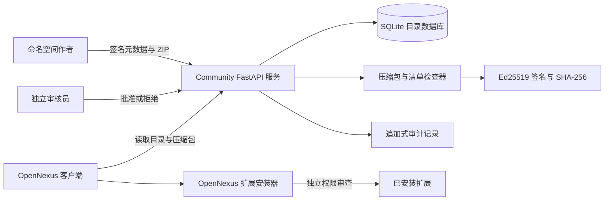
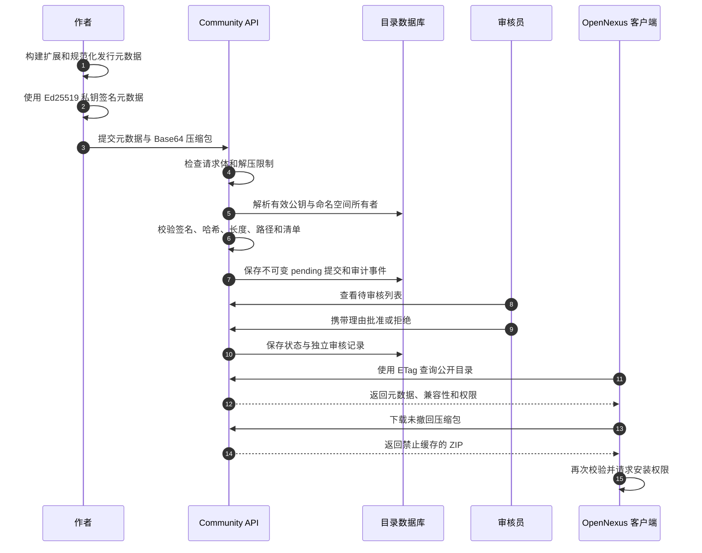
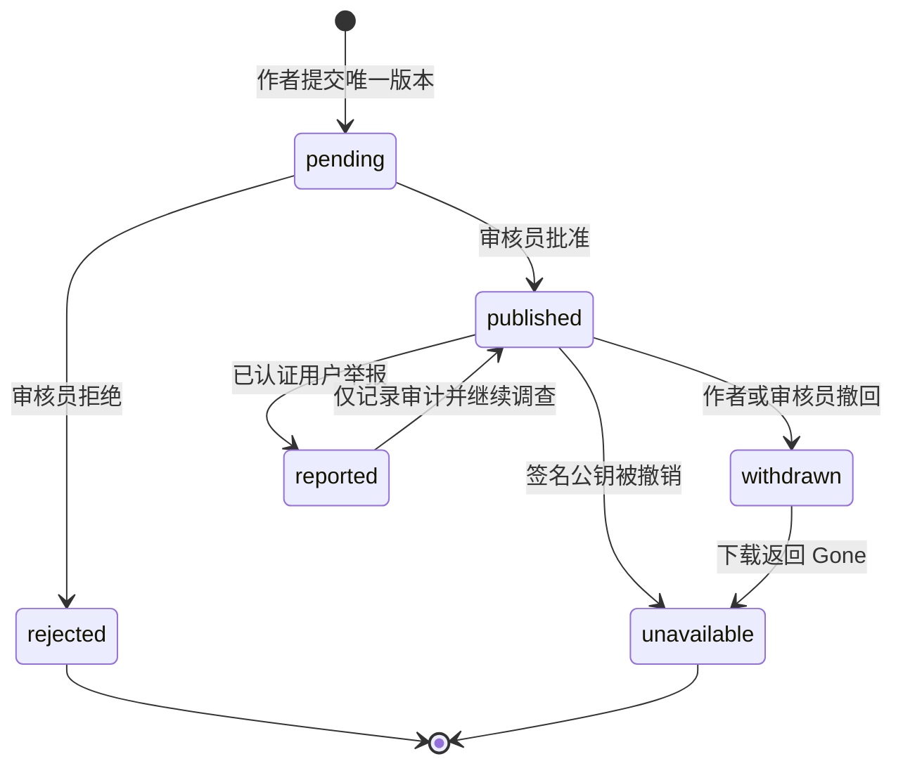
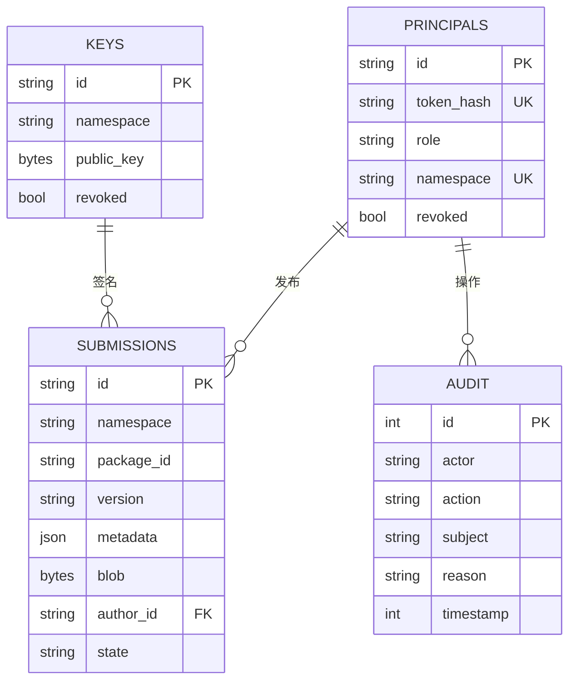

# Community for OpenNexus

**简体中文** | [English](README.md)

[](https://github.com/KiriAky107/Community-for-OpenNexus/releases/tag/v0.5.2-alpha1)


[](LICENSE)

Community for OpenNexus 是一个独立的扩展目录原型，用于发布、签名、审核、发现、撤回和举报 OpenNexus 扩展包，支持主题、Skill、Plugin、MCP 配置、Persona、模板和模型安装方案。

> 当前实现是 Alpha 工程原型，不是生产市场。它保存扩展压缩包和目录身份，但不保存用户 Vault、模型提供商凭据、私钥或 Sync Server 会话。

## 信任模型与架构



社区服务验证发布完整性和审核状态；安装仍然是桌面宿主的独立信任决定。已发布不代表扩展自动安全或自动获得执行权限。

## 扩展发布流程



## 发行状态



版本按 `(namespace, package_id, version)` 永久不可变。撤回会保留元数据和审计历史，不能用不同构建静默替换同一版本。

## 数据库关系



当前 Schema 版本为 `1`。命名空间与签名者之间的逻辑关系在应用事务中校验，即使 SQLite 表没有声明对应外键也不会跳过所有权检查。

## 扩展包验证

每个发行版本必须声明命名空间、包 ID、语义化版本、类型、作者、许可证、SHA-256、长度、平台、架构、应用兼容版本、依赖、权限、变更说明、签名 Key 和 Ed25519 签名。

检查器会：

- 拒绝路径穿越、无效 Windows 路径、忽略大小写的重名、符号链接、加密、未知压缩、过多条目和解压炸弹；
- 按签名元数据校验 ZIP 长度和 SHA-256；
- 要求唯一的类型清单，并核对身份、版本和权限；
- 拒绝 JSON 类扩展中出现密钥或对话历史；
- 在审核过程中绝不执行扩展代码。

| 类型 | 必需清单 |
| --- | --- |
| Theme | `theme.yaml` |
| Skill | `skill.yaml` |
| Plugin | `plugin.yaml` |
| MCP | `mcp.json` |
| Persona | `persona.json` |
| Template | `template.json` |
| Model 方案 | `model.json` |

## 开发与运行

```powershell
uv sync --frozen
uv run pytest
uv run python -m community serve
```

开发服务只监听 `127.0.0.1:8081`。部署前将 `COMMUNITY_DATABASE_PATH` 指向受管理目录，并将 `COMMUNITY_ALLOWED_ORIGINS` 设置为明确的逗号分隔白名单。任何外部可访问实例都需要 TLS、认证控制、限流、监控和备份。

## 管理命令

```powershell
uv run python -m community create-author --id AUTHOR_ID --namespace NAMESPACE --token-file C:/private/author.token
uv run python -m community create-moderator --id MODERATOR_ID --token-file C:/private/moderator.token
uv run python -m community add-key --id KEY_ID --namespace NAMESPACE --public-key-file C:/public/author-key.txt
```

Token 只写入指定的新文件，不在终端打印。服务只接收 Base64 Ed25519 公钥，绝不能接收私钥。Token 文件必须使用操作系统 ACL 限制读取。

## API 概览

| 路由 | 访问级别 | 用途 |
| --- | --- | --- |
| `/health` | 公开 | 进程健康 |
| `/catalog/v1/sources` | 公开 | 来源身份和公钥 |
| `/catalog/v1/packages` | 公开 | 支持 ETag 的搜索和分页目录 |
| `/catalog/v1/releases/.../archive` | 有效发行公开 | 下载扩展压缩包 |
| `/catalog/v1/publish/submissions` | 作者 | 命名空间内不可变发布 |
| `/catalog/v1/moderation/reviews` | 审核员 | 独立审核队列和决定 |
| `/withdraw`、`/reports`、`/keys/.../revoke` | 相应认证角色 | 事件和生命周期控制 |

## 生产差距

当前 Bearer Token 没有到期机制。生产市场仍需要账户登录、Token 轮换与撤销流程、持久限流、更完善的审核治理、可用性监控、备份恢复、滥用处理和 TLS 反向代理。不得将本原型描述为已经上线的生产市场。

## 安全与社区

- 扩展包不得包含密钥、私钥、个人信息、对话历史或用户 Vault 内容。
- 必须明确许可证；`unknown`、`none`、`unlicensed` 和 `tbd` 会被拒绝。
- 举报与撤回必须提供理由并保留审计记录。
- 漏洞按照 [SECURITY.md](SECURITY.md) 报告。
- 贡献遵循[贡献指南](CONTRIBUTING.md)和[社区行为准则](CODE_OF_CONDUCT.md)。
- 目录缺陷与扩展政策建议使用仓库 Issue 表单。

相关仓库：[OpenNexus](https://github.com/KiriAky107/OpenNexus) 与 [Sync for OpenNexus](https://github.com/KiriAky107/Sync-for-OpenNexus)。

## 许可证

本项目采用 [MIT License](LICENSE)。公开扩展包和第三方组件仍适用各自许可证。
