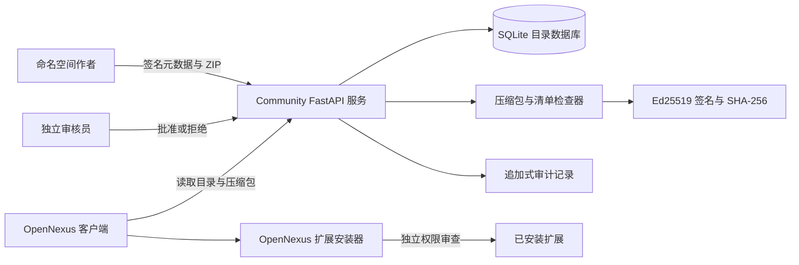
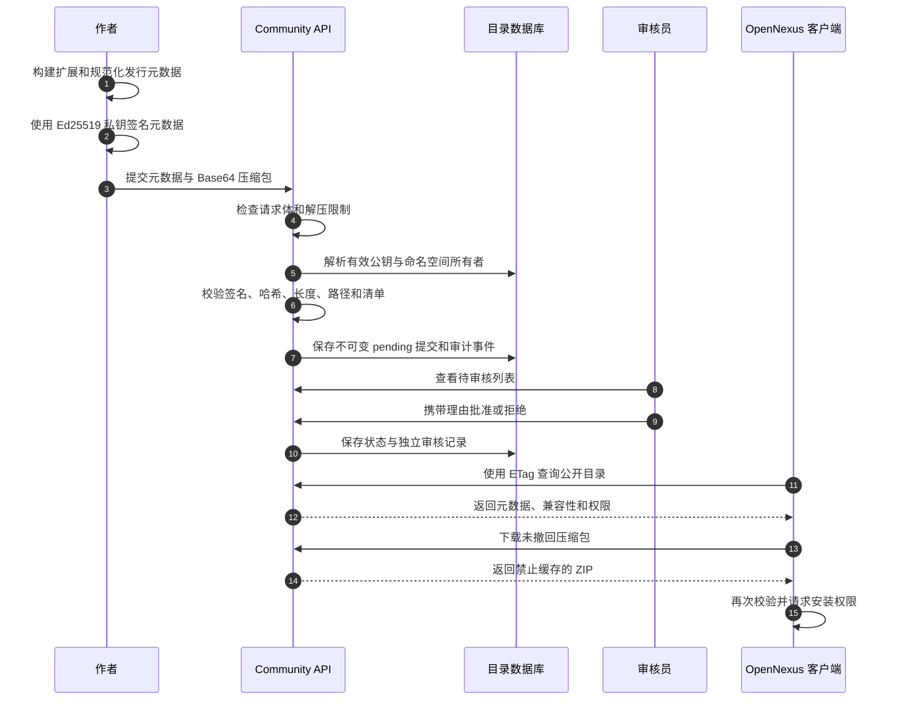
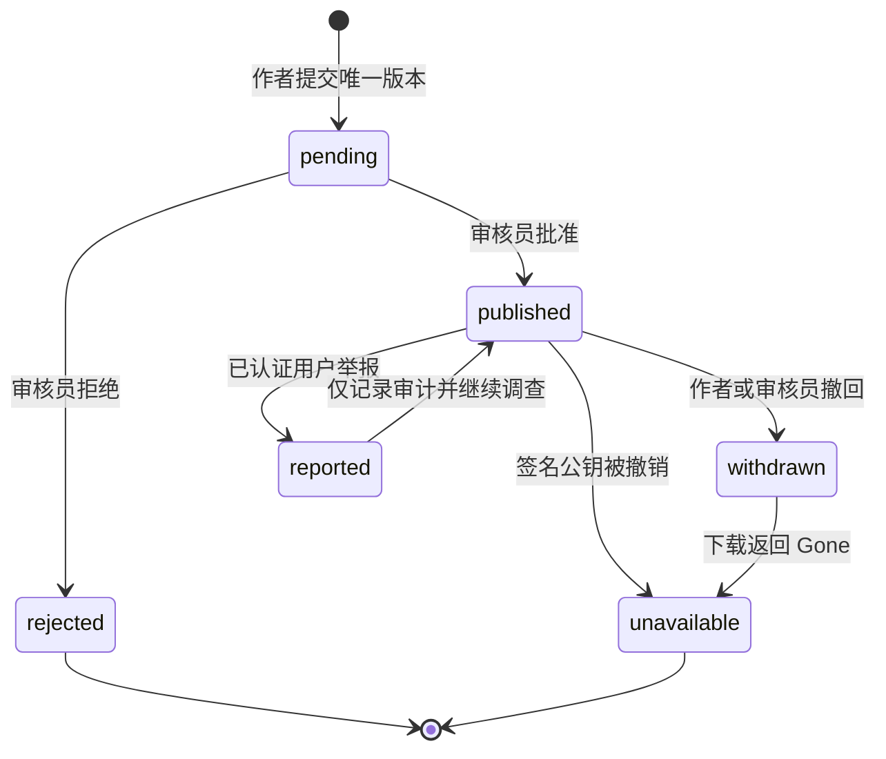
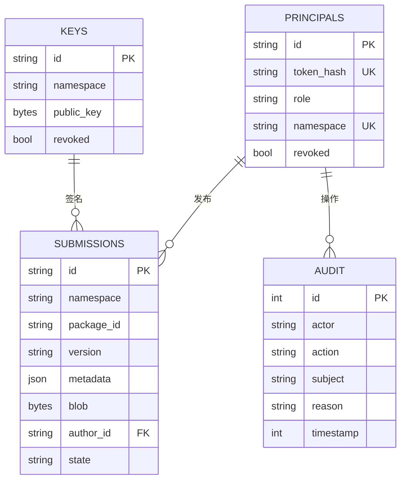

# Community for OpenNexus

**简体中文** | [English](README.md)

[](https://github.com/KiriAky107/Community-for-OpenNexus/releases/tag/v0.6.0)

[](LICENSE)

Community for OpenNexus 是一个独立的扩展目录服务，用于发布、签名、审核、发现、撤回和举报 OpenNexus 扩展包，支持主题、Skill、Plugin、MCP 配置、Persona、模板和模型安装方案。

服务保存扩展压缩包和目录身份。用户 Vault、模型提供商凭据、私钥和 Sync 会话由各自所有者管理。


## 0.6.0 更新

- 目录在数据库查询层过滤、计数和分页，版本按语义版本排序，并提供查询一致的 ETag。
- 配套桌面完整分页、已安装版本和更新审核，支持来源、权限、依赖与兼容信息核对。
- Persona、实验模板、MCP 配置与模型方案使用统一声明契约，模板保留源文件和输入的真实扩展名。
- 作者与审核员 CLI 支持提交校验、独立审核、撤回、举报处理和游标审计，发行保持不可变。
- 提供就绪检查、在线 SQLite 备份、摘要与签名校验及新目标恢复，GitHub CI 验证部署包和固定源码。

配套版本：OpenNexus **0.6.0**、Sync for OpenNexus **0.6.0**、Community for OpenNexus **0.6.0**。Sync 使用 `/sync/v1`，Community 使用 `/catalog/v1`；产品版本与协议版本分别维护。

## 信任模型与架构


```mermaid
flowchart LR
    Author[命名空间作者] -->|签名元数据与 ZIP| API[Community FastAPI 服务]
    Moderator[独立审核员] -->|批准或拒绝| API
    Client[OpenNexus 客户端] -->|读取目录与压缩包| API
    API --> DB[(SQLite 目录数据库)]
    API --> Inspect[压缩包与清单检查器]
    Inspect --> Verify[Ed25519 签名与 SHA-256]
    API --> Audit[追加式审计记录]
    Client --> Host[OpenNexus 扩展安装器]
    Host -->|独立权限审查| Active[已安装扩展]
```

社区服务验证发布完整性和审核状态；安装仍然是桌面宿主的独立信任决定。已发布不代表扩展自动安全或自动获得执行权限。

## 扩展发布流程


```mermaid
sequenceDiagram
    autonumber
    participant Author as 作者
    participant Catalog as Community API
    participant DB as 目录数据库
    participant Moderator as 审核员
    participant Client as OpenNexus 客户端

    Author->>Author: 构建扩展和规范化发行元数据
    Author->>Author: 使用 Ed25519 私钥签名元数据
    Author->>Catalog: 提交元数据与 Base64 压缩包
    Catalog->>Catalog: 检查请求体和解压限制
    Catalog->>DB: 解析有效公钥与命名空间所有者
    Catalog->>Catalog: 校验签名、哈希、长度、路径和清单
    Catalog->>DB: 保存不可变 pending 提交和审计事件
    Moderator->>Catalog: 查看待审核列表
    Moderator->>Catalog: 携带理由批准或拒绝
    Catalog->>DB: 保存状态与独立审核记录
    Client->>Catalog: 使用 ETag 查询公开目录
    Catalog-->>Client: 返回元数据、兼容性和权限
    Client->>Catalog: 下载未撤回压缩包
    Catalog-->>Client: 返回禁止缓存的 ZIP
    Client->>Client: 再次校验并请求安装权限
```

## 发行状态


```mermaid
stateDiagram-v2
    [*] --> pending: 作者提交唯一版本
    pending --> published: 审核员批准
    pending --> rejected: 审核员拒绝
    published --> withdrawn: 作者或审核员撤回
    published --> reported: 已认证用户举报
    reported --> published: 仅记录审计并继续调查
    published --> unavailable: 签名公钥被撤销
    withdrawn --> unavailable: 下载返回 Gone
    rejected --> [*]
    unavailable --> [*]
```

版本按 `(namespace, package_id, version)` 永久不可变。撤回会保留元数据和审计历史，不能用不同构建静默替换同一版本。

## 数据库关系


```mermaid
erDiagram
    PRINCIPALS ||--o{ SUBMISSIONS : 发布
    PRINCIPALS ||--o{ AUDIT : 操作
    KEYS ||--o{ SUBMISSIONS : 签名

    PRINCIPALS {
        string id PK
        string token_hash UK
        string role
        string namespace UK
        bool revoked
    }
    KEYS {
        string id PK
        string namespace
        bytes public_key
        bool revoked
    }
    SUBMISSIONS {
        string id PK
        string namespace
        string package_id
        string version
        json metadata
        bytes blob
        string author_id FK
        string state
    }
    AUDIT {
        int id PK
        string actor
        string action
        string subject
        string reason
        int timestamp
    }
```

当前 Schema 版本为 `1`。命名空间与签名者之间的逻辑关系在应用事务中校验，即使 SQLite 表没有声明对应外键也不会跳过所有权检查。

## 扩展包验证

每个发行版本必须声明命名空间、包 ID、语义化版本、类型、作者、许可证、SHA-256、长度、平台、架构、应用兼容版本、依赖、权限、变更说明、签名 Key 和 Ed25519 签名。

检查器会：

- 拒绝路径穿越、无效 Windows 路径、忽略大小写的重名、符号链接、加密、未知压缩、过多条目和解压炸弹；
- 按签名元数据校验 ZIP 长度和 SHA-256；
- 要求唯一的类型清单，并核对身份、版本和权限；
- 拒绝 JSON 类扩展中出现密钥或对话历史；
- 在审核过程中绝不执行扩展代码。

| 类型 | 必需清单 |
| --- | --- |
| Theme | `theme.yaml` |
| Skill | `skill.yaml` |
| Plugin | `plugin.yaml` |
| MCP | `mcp.json` |
| Persona | `persona.json` |
| Template | `template.json` |
| Model 方案 | `model.json` |

MCP 参数必须是字符串。凭据通过 `secret_environment_keys` 或 `secret_header_keys` 声明，明文 Token 和 Authorization 值会被拒绝。包不能携带启用、信任、测试或目标版本状态。桌面应用已审核的 MCP 配置后保持禁用，用户另行审核命令、测试连接并启用。

Model 方案需要非空的 `source`、`revision`、`license`、资源对象和验证平台列表。本地 Embedding 运行方案增加 `model_key` 与 `runtime_config`，其中 `embedding_model` 必须与该 key 相同；CPU 线程、内存和超时使用有界整数。桌面在应用设置前核对模型的固定仓库、修订和许可证。安装权重与重建索引仍需用户明确操作。[可执行配置示例](tests/fixtures/community-v1-configurations.json) 与桌面共享，并由 CI 核对；只有元数据的旧方案仍可读取。

## 开发与运行

```powershell
uv sync --frozen
uv run pytest
uv run python -m community serve
```

开发服务只监听 `127.0.0.1:8081`。部署前将 `COMMUNITY_DATABASE_PATH` 指向受管理目录，并将 `COMMUNITY_ALLOWED_ORIGINS` 设置为明确的逗号分隔白名单。任何外部可访问实例都需要 TLS、认证控制、限流、监控和备份。

## 管理命令

```powershell
uv run python -m community create-author --id AUTHOR_ID --namespace NAMESPACE --token-file C:/private/author.token
uv run python -m community create-moderator --id MODERATOR_ID --token-file C:/private/moderator.token
uv run python -m community add-key --id KEY_ID --namespace NAMESPACE --public-key-file C:/public/author-key.txt
```

Token 只写入指定的新文件，不在终端打印。服务只接收 Base64 Ed25519 公钥，绝不能接收私钥。Token 文件必须使用操作系统 ACL 限制读取。

作者和审核员可以用同一 CLI 访问 HTTPS 目录。`COMMUNITY_URL` 指定服务地址，`--token-file` 读取现有角色 Token。每次写操作都由独立命令触发，提交前先核对归档和元数据签名。

```powershell
uv run python -m community check-package --release-file release.json --archive-file package.zip --public-key-file author-key.txt
uv run python -m community submit --release-file release.json --archive-file package.zip --public-key-file author-key.txt --token-file author.token
uv run python -m community submissions --package-id PACKAGE_ID --version VERSION --token-file author.token
uv run python -m community reviews --offset 0 --limit 30 --token-file moderator.token
uv run python -m community review --submission-id SUBMISSION_ID --approve --reason "已核对包内容和权限" --token-file moderator.token
uv run python -m community reports --token-file moderator.token
uv run python -m community resolve-report --report-id REPORT_ID --decision addressed --reason "记录处理结果" --token-file moderator.token
uv run python -m community audit --after 0 --limit 30 --token-file moderator.token
```

拒绝审核使用 `--reject`；撤回使用 `withdraw --release-id ID --reason TEXT`，举报使用 `report --release-id ID --reason TEXT`，撤销签名密钥使用 `revoke-key --key-id ID --reason TEXT`。`status --submission-id ID` 返回权限范围内的真实状态。队列支持分页，审计使用游标；举报处理后仍保留原始审计记录。写请求中断时返回退出码 3 和 `OUTCOME_UNKNOWN`，不会自动重发。先查询 `submissions` 或当前状态，再决定后续操作。客户端拒绝重定向；隔离测试的本机 HTTP 地址必须显式添加 `--allow-loopback-http`。

## 就绪检查、备份与恢复

`/health` 检查进程，`/ready` 检查现有数据库的 schema、访问及写事务可用性，检查不改变记录；不可用时返回 503。[systemd 配置](deployment/opennexus-community.service) 和[环境变量示例](deployment/community.env.example) 使用非特权服务账号、私有数据目录和本机监听地址。将源码安装到 `/opt/opennexus-community`，创建 `opennexus-community` 账号，并将已核对的配置放到 `/etc/opennexus-community.env`。使用系统提供的 Python 3.12 或更新版本执行 `uv sync --frozen --python /usr/bin/python3 --no-managed-python`，避免解释器依赖被服务保护的用户主目录。对外的 TLS 反向代理由部署者配置。

```powershell
uv run python -m community backup --output-dir C:/private/catalog-backup
uv run python -m community verify-backup --input-dir C:/private/catalog-backup --expected-sha256 RECORDED_SHA256
uv run python -m community restore --input-dir C:/private/catalog-backup --output C:/private/restored-catalog.sqlite3 --expected-sha256 RECORDED_SHA256
```

备份采用 SQLite 在线快照 API，包含 WAL 中已提交的数据。完成清单记录数据库哈希、记录数量和签名归档检查；请另行保存返回的哈希。校验检查 SQLite 结构、元数据签名及归档摘要，保留已撤销的密钥、已撤回的发行、旧签名版本和审计记录。没有完整清单的中断备份无法通过校验。恢复必须提供已记录的哈希及新的输出路径，不会替换运行中的数据库，也不改变账号或发行状态。备份含账号 Token 哈希，需要操作系统权限保护。核对恢复结果后，先停止服务，再显式修改环境配置中的数据库路径并重启。

## API 概览

| 路由 | 访问级别 | 用途 |
| --- | --- | --- |
| `/health` | 公开 | 进程健康 |
| `/ready` | 公开 | 数据库就绪检查 |
| `/catalog/v1/sources` | 公开 | 来源身份和公钥 |
| `/catalog/v1/packages` | 公开 | 支持 ETag 的搜索和分页目录 |
| `/catalog/v1/releases/.../archive` | 有效发行公开 | 下载扩展压缩包 |
| `/catalog/v1/publish/submissions` | 作者 | 命名空间内不可变发布 |
| `/catalog/v1/moderation/reviews` | 审核员 | 独立审核队列和决定 |
| `/catalog/v1/publish/submissions/...` | 所有者或审核员 | 发布状态和丢失回执核对 |
| `/catalog/v1/moderation/audit`、`/reports/...` | 审核员 | 审计分页、举报及带理由的处理 |
| `/withdraw`、`/reports`、`/keys/.../revoke` | 相应认证角色 | 事件和生命周期控制 |

## 生产差距

当前 Bearer Token 没有到期机制。生产市场仍需要账户登录、Token 轮换与撤销流程、持久限流、更完善的审核治理、可用性监控、滥用处理和 TLS 反向代理。不得将本原型描述为已经上线的生产市场。

## 安全与社区

- 扩展包不得包含密钥、私钥、个人信息、对话历史或用户 Vault 内容。
- 必须明确许可证；`unknown`、`none`、`unlicensed` 和 `tbd` 会被拒绝。
- 举报与撤回必须提供理由并保留审计记录。
- 漏洞按照 [SECURITY.md](SECURITY.md) 报告。
- 贡献遵循[贡献指南](CONTRIBUTING.md)和[社区行为准则](CODE_OF_CONDUCT.md)。
- 目录缺陷与扩展政策建议使用仓库 Issue 表单。

相关仓库：[OpenNexus](https://github.com/KiriAky107/OpenNexus) 与 [Sync for OpenNexus](https://github.com/KiriAky107/Sync-for-OpenNexus)。

## 许可证

本项目采用 [MIT License](LICENSE)。公开扩展包和第三方组件仍适用各自许可证。
