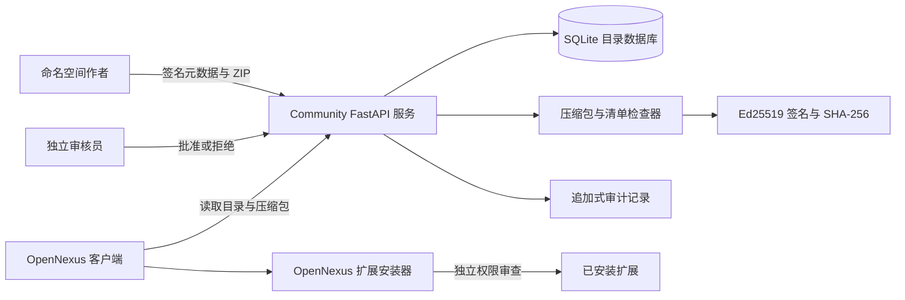
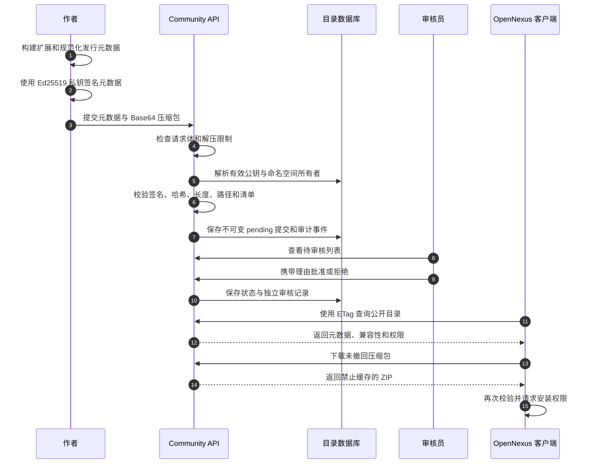
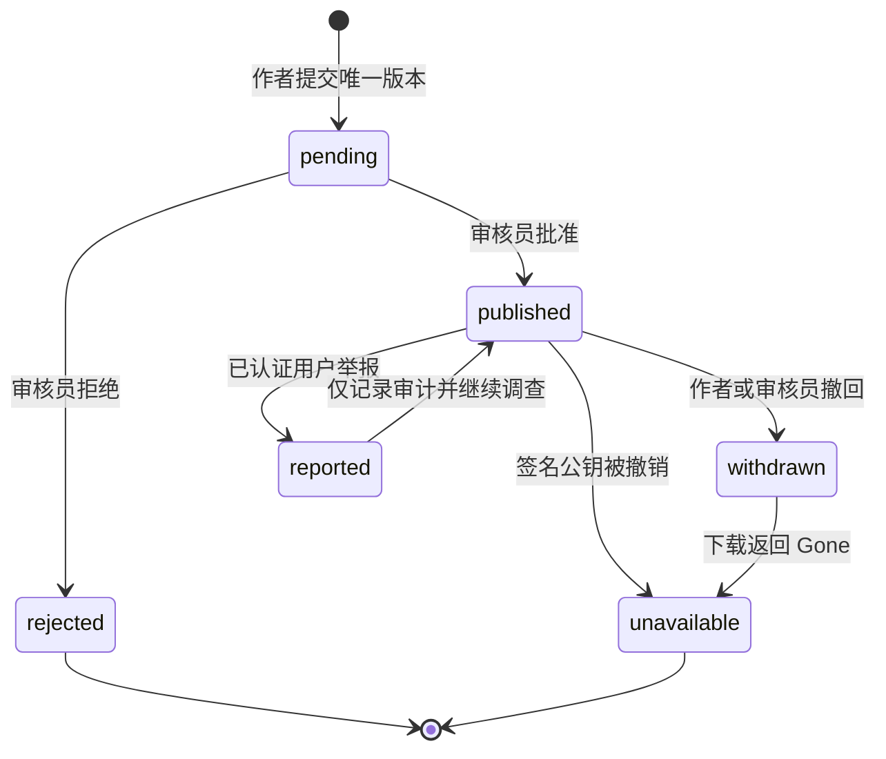
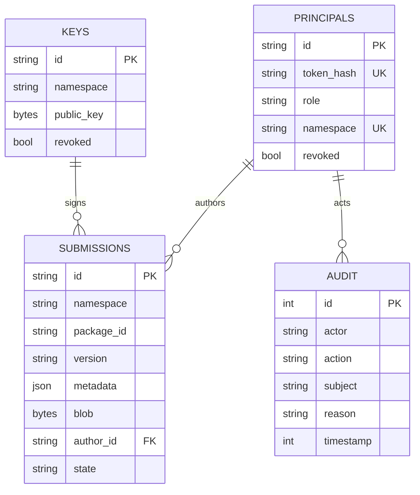

<div align="center">

  

  <h1>Community for OpenNexus</h1>

  <p><strong>OpenNexus 的签名扩展目录</strong></p>

  <p>发现 OpenNexus 扩展，核对权限与来源，并通过独立审核发布签名扩展包。</p>

  <p>
    <a href="README.md">English</a> • <a href="#快速开始">快速开始</a> • <a href="#核心亮点">核心亮点</a> • <a href="#系统架构">系统架构</a> • <a href="#本地开发">本地开发</a> • <a href="https://github.com/KiriAky107/Community-for-OpenNexus/releases">发布日志</a>
  </p>

  <p>
    <a href="https://github.com/KiriAky107/Community-for-OpenNexus/releases/tag/v0.6.0"></a> <a href="https://github.com/KiriAky107/Community-for-OpenNexus/actions/workflows/ci.yml"></a>     <a href="LICENSE"></a>
  </p>

</div>

---

当前版本： [v0.6.0](https://github.com/KiriAky107/Community-for-OpenNexus/releases/tag/v0.6.0)。

当前开发新增 `/` 公开网页目录和 `/workbench` 作者与审核工作台。目录提供可分享的扩展详情、版本历史、搜索和类型筛选。工作台校验签名上传，展示实际文件与前版变化，并通过原操作编号核对中断的写入。浏览器下载会重新确认发行与签名公钥状态，核对大小和 SHA-256，再提供明确的保存链接。

## 0.6.0 更新

- 目录在数据库查询层过滤、计数和分页，版本按语义版本排序，并提供查询一致的 ETag。
- 配套桌面完整分页、已安装版本和更新审核，支持来源、权限、依赖与兼容信息核对。
- Persona、实验模板、MCP 配置与模型方案使用统一声明契约，模板保留源文件和输入的真实扩展名。
- 作者与审核员 CLI 支持提交校验、独立审核、撤回、举报处理和游标审计，发行保持不可变。
- 提供就绪检查、在线 SQLite 备份、摘要与签名校验及新目标恢复，GitHub CI 验证部署包和固定源码。

## 核心亮点

- **发现扩展**：搜索并分页浏览主题、Skill、Plugin、MCP 配置、Persona、模板和模型方案的版本目录。
- **安装前核对**：查看作者、兼容要求、依赖、权限和签名归档信息，再由桌面端请求安装批准。
- **作者保管私钥**：使用本地 Ed25519 私钥签名，目录接收公钥、签名元数据和归档并核对完整性。
- **独立审核**：提交唯一版本、查看实际状态，由另一位审核员携带理由批准或拒绝。
- **可追溯状态**：举报、撤回和签名密钥撤销均保留不可变版本及审计记录。
- **目录数据恢复**：检查就绪状态、创建 SQLite 在线快照，在向新目标恢复前校验签名和摘要。

## 快速开始

```powershell
uv sync --frozen
uv run python -m community serve
```

开发服务只监听 `127.0.0.1:8081`。部署前将 `COMMUNITY_DATABASE_PATH` 指向受管理目录，并将 `COMMUNITY_ALLOWED_ORIGINS` 设置为明确的逗号分隔白名单。任何外部可访问实例都需要 TLS、认证控制、限流、监控和备份。

打开 `http://127.0.0.1:8081/` 浏览网页目录。仓库中已构建的网页由同一服务进程提供，运行时无需 Node.js 进程。检查 `/health`、`/ready` 和 `/catalog/v1/packages`，再在 OpenNexus 中配置目录地址。需要发布扩展时再创建作者和审核员身份，见[管理命令](#管理命令)。

## 核心工作流

### 1. 查找并安装扩展

在网页按名称或描述搜索、选择类型并打开发行。通过 `/packages/{namespace}/{package_id}?version={version}` 分享指定版本，查看作者、许可、兼容范围、依赖、权限和原始更新说明。点击“下载归档”，大小与哈希核对后再点击“保存已校验 ZIP”。发行撤回、公钥撤销或缺失会禁用下载；公钥状态独立于目录 ETag 重新读取。缓存仅保存本次浏览器会话中相同查询的结果，并显示最后确认时间。

在 OpenNexus 中对比已安装和可用版本后再安装。桌面端验证扩展的密码学签名并请求安装批准；网页的哈希核对不会授予执行权限。

### 2. 发布并审核签名版本

准备清单和 ZIP，在本地签名规范化发行元数据，再运行 `check-package`。使用作者 Token 提交，由独立审核员身份查看并处理。当前 CLI 命令见[管理命令](#管理命令)。

离线作者工具从一个内容目录生成 ZIP，检查实际文件与类型清单，并签名发行元数据。在仓库之外建立私有目录，通过操作系统访问控制保护它。密钥只需生成一次；仅向命名空间管理员登记 `public.key`，`private.key` 留在作者设备上。

```powershell
uv run python -m community.publisher keygen --output-dir C:/private/author-key
uv run python -m community.publisher build --metadata-file C:/author/metadata.json --content-dir C:/author/payload --private-key-file C:/private/author-key/private.key --output-dir C:/author/signed-1.0.0 --namespace YOUR_NAMESPACE --author-id YOUR_AUTHOR_ID --key-id YOUR_KEY_ID --published-at 2026-10-08T08:00:00Z
uv run python -m community check-package --release-file C:/author/signed-1.0.0/release.json --archive-file C:/author/signed-1.0.0/archive.zip --public-key-file C:/author/signed-1.0.0/public.key
```

输入元数据 JSON 声明 `package_id`、`type`、`version`、`name`、`license`、`description`、`platforms`、`architectures`、`min_app_version` 和 `changelog`，也可声明依赖、权限与应用版本上限。身份、发布时间、ZIP 大小、摘要和签名由命令参数与实际字节生成，不放入输入 JSON。输出目录必须是内容目录之外的新目录。`complete.json` 记录最终元数据与文件哈希；缺少此文件表示输出中断。已有密钥与输出均不会被覆盖。检查文件清单后，在工作台选择 `release.json` 与 `archive.zip`。构建过程不连接目录服务，也不执行包内代码。

源码仓库包含五个原创 MIT 许可示例。每个内容目录携带完整许可和 `provenance.json`，元数据保留中英文更新说明。使用自己的命名空间为这些包源码签名，再通过工作台提交。清单面向 Windows x86_64 桌面配置与导入流程，发布前按每个包的 `min_app_version` 核对目标客户端。

| 源码 | 签名类型 | 使用结果与前提 |
| --- | --- | --- |
| [清晰讲解](examples/clear-explanations/metadata.json) | `persona` | 审阅具体讲解与自测提示，再应用到选定的 Persona 目标。不包含凭据或历史记录。 |
| [测量摘要](examples/measurement-summary/payload/template.json) | `template` | 将 `main.py`、`config.json`、`data/measurements.csv` 导入为可审阅实验文件。随包 Python 运行时从四条虚构测量生成 JSON 与 Markdown 摘要。运行与成果导入分别确认。 |
| [只读数值摘要](examples/summary-mcp/payload/mcp.json) | `mcp` | 应用本地 Streamable HTTP 连接。单独启动[原创示例服务器](examples/summary-mcp/server.py)，再审阅、测试并启用连接。工具只汇总数值参数，不访问文件或凭据。 |
| [Bekko CPU 方案](examples/bekko-cpu-plan/payload/model.json) | `model` | 应用桌面已固定的 Bekko 模型身份与 CPU 预算。方案不含模型权重，也不触发下载；获取与推理仍由独立模型管理流程处理。内容内链接上游模型来源与 MIT 许可。 |
| [测量实验讲解](examples/measurement-coach/metadata.json) | `persona` | 配合测量摘要1.1解释平均值、中位数和阈值变化。先从同一来源暂存模板依赖，再检查完整安装顺序；导入实验文件与应用人设仍分别确认。 |

```powershell
uv run python -m community.publisher build --metadata-file examples/clear-explanations/metadata.json --content-dir examples/clear-explanations/payload --private-key-file C:/private/author-key/private.key --output-dir C:/author/clear-explanations-1.1.0 --namespace YOUR_NAMESPACE --author-id YOUR_AUTHOR_ID --key-id YOUR_KEY_ID --published-at 2026-10-08T08:00:00Z
uv run python examples/summary-mcp/server.py --port 18970
```

仅在试用 MCP 示例时，在另一终端执行第二条命令。它只监听 `127.0.0.1`，目录安装与配置应用均不会启动它。更新时，将选定源码复制到作者工作目录，修改内容与 `metadata.json` 的版本和更新说明，再构建到新输出目录。经作者工作台提交与独立审核后，用户对比新版，分别批准安装和应用。缺少依赖或校验失败时，不修改原来的签名版本。

配置 `COMMUNITY_WEB_ORIGIN` 后，从“作者与审核”进入 `/workbench`，使用已有角色 Token 登录。密码框在发出请求前清空；身份与 CSRF 证明只保留在内存中，服务器设置有期限的 HttpOnly Cookie。作者选择已签名发行 JSON 和原 ZIP，执行只读预检，核对许可、权限、签名、类型清单和实际文件哈希，再确认提交。提交状态和拒绝原因按页查看。元数据不超过 1 MiB，ZIP 不超过 10 MiB。

审核员通过自己的会话处理待审提交，对比前一发布的元数据、权限与文件变化，并填写理由批准或拒绝。文件与差异每页最多 100 项。清单最多显示前 64 KiB，截断会明确标注；“保存已校验 ZIP”提供原归档供完整检查。包内文字按原文显示，不执行包内内容。

### 3. 处理更新或事件

将修改后的内容发布为新的不可变版本，保留上一版的签名元数据与 ZIP。

1. 将包源码复制到作者工作目录，修改内容，并更新 `metadata.json` 的版本与双语变更说明。使用[离线作者工具](#2-发布并审核签名版本)构建到新输出目录，核对 `complete.json` 与原 ZIP 哈希。
2. 在 `/workbench` 选择新的 `release.json` 和 `archive.zip`，执行只读预检后确认冻结的提交。独立审核员检查实际文件与权限差异、核对原归档，再填写理由批准或拒绝。
3. 在桌面的“已安装与更新”中选择“查询兼容更新”，核对变更说明、权限和完整安装计划后“确认更新”。缺少依赖时，先从同一来源获取符合声明范围的版本；测量实验讲解示例需要 `measurement-summary >=1.1.0, <2.0.0`。
4. 为已安装内容明确选择应用目标：预览当前知识库人设，选择模板文件及目标路径，或对比已有 MCP／模型配置。分别确认这些差异。目标在预览后发生变化时，重新预览并核对新的当前内容，再次确认。

“预览回滚”会在确认前显示上一版已安装包及配置，保留已应用到用户目标的文件和设置。例如，将 MCP 包回滚到 1.0 后，先前独立应用的 45 秒超时仍会保留；修改这一设置需要另行预览目标差异并确认。MCP 配置应用后保持禁用和未审批，模型方案只应用资源设置，不下载权重。

在 `/workbench` 为已发布版本填写理由举报。独立审核员检查举报及对应包，记录已处理或驳回的决定。撤回是由作者或审核员另行确认的操作。公开目录标记已撤回的发行并禁用下载；撤销签名密钥会禁用使用该密钥的全部发行下载。桌面在再次应用已安装内容前核对当前撤回与签名密钥状态，同时保留已安装包、原先应用的笔记和设置。

工作台的每次确认操作会冻结内容与原操作编号。结果未确认时锁定资源和身份切换，先点击“只读查询原编号”。已有回执用于确认原操作，未发现回执时才允许明确按原编号与原内容重试；不会自动重试写入。会话失效后清空旧包数据，只保留回执编号；使用原身份重新登录可继续查询。失效后仍无回执时，需要由管理员用原内容与原编号核对。“我的会话”只列出自己的有效浏览器会话，可撤销其中任意会话，包括当前会话。

### 4. 备份目录

创建在线快照，将返回的哈希另行保管，并在恢复到新数据库路径前执行验证。核对恢复结果后再切换数据库，见[备份与恢复](#备份与恢复)。

## 系统架构


```mermaid
flowchart LR
    Author[命名空间作者] -->|签名元数据与 ZIP| API[Community FastAPI 服务]
    Moderator[独立审核员] -->|批准或拒绝| API
    Client[OpenNexus 客户端] -->|读取目录与压缩包| API
    API --> DB[(SQLite 目录数据库)]
    API --> Inspect[压缩包与清单检查器]
    Inspect --> Verify[Ed25519 签名与 SHA-256]
    API --> Audit[追加式审计记录]
    Client --> Host[OpenNexus 扩展安装器]
    Host -->|独立权限审查| Active[已安装扩展]
```

社区服务验证发布完整性和审核状态；安装仍然是桌面宿主的独立信任决定。已发布不代表扩展自动安全或自动获得执行权限。

## 扩展发布流程


```mermaid
sequenceDiagram
    autonumber
    participant Author as 作者
    participant Catalog as Community API
    participant DB as 目录数据库
    participant Moderator as 审核员
    participant Client as OpenNexus 客户端

    Author->>Author: 构建扩展和规范化发行元数据
    Author->>Author: 使用 Ed25519 私钥签名元数据
    Author->>Catalog: 提交元数据与 Base64 压缩包
    Catalog->>Catalog: 检查请求体和解压限制
    Catalog->>DB: 解析有效公钥与命名空间所有者
    Catalog->>Catalog: 校验签名、哈希、长度、路径和清单
    Catalog->>DB: 保存不可变 pending 提交和审计事件
    Moderator->>Catalog: 查看待审核列表
    Moderator->>Catalog: 携带理由批准或拒绝
    Catalog->>DB: 保存状态与独立审核记录
    Client->>Catalog: 使用 ETag 查询公开目录
    Catalog-->>Client: 返回元数据、兼容性和权限
    Client->>Catalog: 下载未撤回压缩包
    Catalog-->>Client: 返回禁止缓存的 ZIP
    Client->>Client: 再次校验并请求安装权限
```

## 发行状态


```mermaid
stateDiagram-v2
    [*] --> pending: 作者提交唯一版本
    pending --> published: 审核员批准
    pending --> rejected: 审核员拒绝
    published --> withdrawn: 作者或审核员撤回
    published --> reported: 已认证用户举报
    reported --> published: 仅记录审计并继续调查
    published --> unavailable: 签名公钥被撤销
    withdrawn --> unavailable: 下载返回 Gone
    rejected --> [*]
    unavailable --> [*]
```

版本按 `(namespace, package_id, version)` 永久不可变。撤回会保留元数据和审计历史，不能用不同构建静默替换同一版本。

## 数据库关系


```mermaid
erDiagram
    PRINCIPALS ||--o{ SUBMISSIONS : authors
    PRINCIPALS ||--o{ AUDIT : acts
    KEYS ||--o{ SUBMISSIONS : signs

    PRINCIPALS {
        string id PK
        string token_hash UK
        string role
        string namespace UK
        bool revoked
    }
    KEYS {
        string id PK
        string namespace
        bytes public_key
        bool revoked
    }
    SUBMISSIONS {
        string id PK
        string namespace
        string package_id
        string version
        json metadata
        bytes blob
        string author_id FK
        string state
    }
    AUDIT {
        int id PK
        string actor
        string action
        string subject
        string reason
        int timestamp
    }
```

当前 Schema 版本为 `1`。命名空间与签名者之间的逻辑关系在应用事务中校验，即使 SQLite 表没有声明对应外键也不会跳过所有权检查。

## 扩展包验证

每个发行版本必须声明命名空间、包 ID、语义化版本、类型、作者、许可证、SHA-256、长度、平台、架构、应用兼容版本、依赖、权限、变更说明、签名 Key 和 Ed25519 签名。

检查器会：

- 拒绝路径穿越、无效 Windows 路径、忽略大小写的重名、符号链接、加密、未知压缩、过多条目和解压炸弹；
- 按签名元数据校验 ZIP 长度和 SHA-256；
- 要求唯一的类型清单，并核对身份、版本和权限；
- 拒绝 JSON 类扩展中出现密钥或对话历史；
- 在审核过程中绝不执行扩展代码。

| 类型 | 必需清单 |
| --- | --- |
| Theme | `theme.yaml` |
| Skill | `skill.yaml` |
| Plugin | `plugin.yaml` |
| MCP | `mcp.json` |
| Persona | `persona.json` |
| Template | `template.json` |
| Model 方案 | `model.json` |

MCP 参数必须是字符串。凭据通过 `secret_environment_keys` 或 `secret_header_keys` 声明，明文 Token 和 Authorization 值会被拒绝。包不能携带启用、信任、测试或目标版本状态。桌面应用已审核的 MCP 配置后保持禁用，用户另行审核命令、测试连接并启用。

Model 方案需要非空的 `source`、`revision`、`license`、资源对象和验证平台列表。本地 Embedding 运行方案增加 `model_key` 与 `runtime_config`，其中 `embedding_model` 必须与该 key 相同；CPU 线程、内存和超时使用有界整数。桌面在应用设置前核对模型的固定仓库、修订和许可证。安装权重与重建索引仍需用户明确操作。[可执行配置示例](tests/fixtures/community-v1-configurations.json) 与桌面共享，并由 CI 核对；只有元数据的旧方案仍可读取。

## 生态项目

| 仓库 | 职责 |
| --- | --- |
| [OpenNexus](https://github.com/KiriAky107/OpenNexus) | 本地知识库编辑、AI 工作流与经过审核的扩展安装 |
| [Sync for OpenNexus](https://github.com/KiriAky107/Sync-for-OpenNexus) | 可选的自托管知识库同步与恢复 |
| [Community for OpenNexus](https://github.com/KiriAky107/Community-for-OpenNexus) | 独立签名扩展目录与发布审核 |

服务按需启用、分别部署。Sync 使用 `/sync/v1`，Community 使用 `/catalog/v1`；产品版本和协议版本分别维护。

## 管理命令

```powershell
uv run python -m community create-author --id AUTHOR_ID --namespace NAMESPACE --token-file C:/private/author.token
uv run python -m community create-moderator --id MODERATOR_ID --token-file C:/private/moderator.token
uv run python -m community add-key --id KEY_ID --namespace NAMESPACE --public-key-file C:/public/author-key.txt
```

Token 只写入指定的新文件，不在终端打印。服务只接收 Base64 Ed25519 公钥，绝不能接收私钥。Token 文件必须使用操作系统 ACL 限制读取。

作者和审核员可以用同一 CLI 访问 HTTPS 目录。`COMMUNITY_URL` 指定服务地址，`--token-file` 读取现有角色 Token。每次写操作都由独立命令触发，提交前先核对归档和元数据签名。

```powershell
uv run python -m community check-package --release-file release.json --archive-file package.zip --public-key-file author-key.txt
uv run python -m community submit --release-file release.json --archive-file package.zip --public-key-file author-key.txt --token-file author.token
uv run python -m community submissions --package-id PACKAGE_ID --version VERSION --token-file author.token
uv run python -m community reviews --offset 0 --limit 30 --token-file moderator.token
uv run python -m community review --submission-id SUBMISSION_ID --approve --reason "已核对包内容和权限" --token-file moderator.token
uv run python -m community reports --token-file moderator.token
uv run python -m community resolve-report --report-id REPORT_ID --decision addressed --reason "记录处理结果" --token-file moderator.token
uv run python -m community audit --after 0 --limit 30 --token-file moderator.token
```

拒绝审核使用 `--reject`；撤回使用 `withdraw --release-id ID --reason TEXT`，举报使用 `report --release-id ID --reason TEXT`，撤销签名密钥使用 `revoke-key --key-id ID --reason TEXT`。`status --submission-id ID` 返回权限范围内的真实状态。队列支持分页，审计使用游标；举报处理后仍保留原始审计记录。写请求中断时返回退出码 3 和 `OUTCOME_UNKNOWN`，不会自动重发。先查询 `submissions` 或当前状态，再决定后续操作。客户端拒绝重定向；隔离测试的本机 HTTP 地址必须显式添加 `--allow-loopback-http`。

### 网页会话 API

将 `COMMUNITY_WEB_ORIGIN` 设置为确切的公开 HTTPS 来源，例如 `https://community.example.org`，TLS 代理须保留该主机名。会话 API 将现有作者或审核员 Token 换为 `Secure`、`HttpOnly`、`SameSite=Strict` Cookie，不返回或保存原 Token。`COMMUNITY_WEB_SESSION_TTL` 指定以秒为单位的绝对有效期，默认 7,200，范围为 300 至 86,400；读取不会延长期限。每个身份最多八个有效会话，每个服务进程按客户端地址限制每分钟十次登录尝试。代理仍需配置外部限流。

`POST /catalog/v1/web/session` 接收 `{ "token": "ROLE_TOKEN" }`。响应和同一路由的只读 `GET` 返回当前角色、命名空间、会话编号、有效期及 CSRF 证明。Cookie 写请求必须通过 `X-Community-CSRF` 携带证明，并提供完全匹配的同源 `Origin`；跨站或同站其他子域的请求均被拒绝。CLI 保留 Bearer 认证，同一请求不能同时携带 Bearer 和网页 Cookie。角色变更和身份撤销在下一次请求生效。

`GET /catalog/v1/web/sessions` 只列出当前身份的有效会话；`POST /catalog/v1/web/sessions/{session_id}/revoke` 撤销自己的会话，重复撤销不会重复产生作用。`POST /catalog/v1/web/session/logout` 移除当前会话并清空 Cookie。`/workbench` 页面通过这些路由工作，不将 Token 或 CSRF 证明放入 URL 或浏览器存储。公开目录仍可免登录浏览。

作者提交前可将已签名元数据和 Base64 ZIP 发到 `POST /catalog/v1/publish/preflight`。预检核对归属、当前签名密钥、签名、实际归档字节及不可变版本，不写入提交或审计，响应包含 `review_digest`。有权限的 `GET /catalog/v1/publish/submissions/{id}/inspection?offset=0&limit=100` 返回实际文件大小和哈希、清单、权限与依赖、决定及与前一已发布版本的变化。文件和变化列表支持分页，超过 64 KiB 的清单预览明确标记为已截断。相应的 `/archive` 路由下载原始 ZIP，供完整检查，不执行包内代码。

Cookie 写请求必须携带新的 32 位小写十六进制 `operation_id`。提交、审核、撤回和举报处理还须提供 `expected_sha256`，其值是已核对的发行摘要，或举报队列中该举报的 `review_digest`。摘要过期时拒绝动作；批准时重新核对签名密钥和归档，并禁止自审。作者通过提交状态查看拒绝及撤回原因。

写请求中断后，读取 `GET /catalog/v1/web/operations/{operation_id}`，只返回当前身份的不可变回执或 `state: "not_found"`。已确认回执保留原结果；用相同编号和完全相同内容显式重试，不会增加另一条提交、审核或举报。将原编号用于不同意图会被拒绝。回执不存在时，先核对原意图，再决定是否显式重发。Bearer 客户端也可携带这些操作字段，现有 CLI 命令保留显式执行且不自动重试的行为。

隔离 HTTP 演示可设置 `COMMUNITY_WEB_ORIGIN=http://127.0.0.1:8081`，再运行 `uv run python -m community serve --allow-insecure-loopback-sessions`；该例外只接受本机来源和监听地址。公开部署使用 HTTPS 和默认的安全 Cookie 策略。

## 备份与恢复

`/health` 检查进程，`/ready` 检查现有数据库的 schema、访问及写事务可用性，检查不改变记录；不可用时返回 503。[systemd 配置](deployment/opennexus-community.service) 和[环境变量示例](deployment/community.env.example) 使用非特权服务账号、私有数据目录和本机监听地址。将源码安装到 `/opt/opennexus-community`，创建 `opennexus-community` 账号，并将已核对的配置放到 `/etc/opennexus-community.env`。使用系统提供的 Python 3.12 或更新版本执行 `uv sync --frozen --python /usr/bin/python3 --no-managed-python`，避免解释器依赖被服务保护的用户主目录。对外的 TLS 反向代理由部署者配置。

```powershell
uv run python -m community backup --output-dir C:/private/catalog-backup
uv run python -m community verify-backup --input-dir C:/private/catalog-backup --expected-sha256 RECORDED_SHA256
uv run python -m community restore --input-dir C:/private/catalog-backup --output C:/private/restored-catalog.sqlite3 --expected-sha256 RECORDED_SHA256
```

备份采用 SQLite 在线快照 API，包含 WAL 中已提交的数据。完成清单记录数据库哈希、记录数量和签名归档检查；请另行保存返回的哈希。校验检查 SQLite 结构、元数据签名及归档摘要，保留已撤销的密钥、已撤回的发行、旧签名版本和审计记录。没有完整清单的中断备份无法通过校验。恢复必须提供已记录的哈希及新的输出路径，不会替换运行中的数据库，也不改变账号或发行状态。备份含账号 Token 哈希，需要操作系统权限保护。核对恢复结果后，先停止服务，再显式修改环境配置中的数据库路径并重启。

本次拥有的备份快照会移除短期网页会话，不会让原服务中的用户退出。校验拒绝含有效会话记录的备份。恢复后网页用户需要重新登录，原身份 Token 和签名包历史保留。旧版没有会话表的备份仍可校验与恢复，启动服务时增加空表。

不可变操作回执保留在审计历史中，备份校验会检查其格式。恢复保留原编号和结果，在恢复后的目录重试已确认的动作仍返回原回执。

## API 概览

| 路由 | 访问级别 | 用途 |
| --- | --- | --- |
| `/`、`/packages/{namespace}/{package_id}` | 公开 | 网页目录与可分享版本详情 |
| `/health` | 公开 | 进程健康 |
| `/ready` | 公开 | 数据库就绪检查 |
| `/catalog/v1/sources` | 公开 | 来源身份和公钥 |
| `/catalog/v1/packages` | 公开 | 支持 ETag 的搜索和分页目录 |
| `/catalog/v1/releases/.../archive` | 有效发行公开 | 下载扩展压缩包 |
| `/catalog/v1/web/session`、`/web/sessions/...` | 同源作者或审核员 | 有效期内的网页会话、自己的会话撤销与退出 |
| `/catalog/v1/web/operations/{operation_id}` | 当前身份 | 只读核对不可变操作回执 |
| `/catalog/v1/publish/preflight` | 作者 | 只读核对签名归档和版本 |
| `/catalog/v1/publish/submissions/.../inspection`、`/archive` | 所有者或审核员 | 文件和版本变化分页检查、原始 ZIP |
| `/catalog/v1/publish/submissions` | 作者 | 命名空间内不可变发布 |
| `/catalog/v1/moderation/reviews` | 审核员 | 独立审核队列和决定 |
| `/catalog/v1/publish/submissions/...` | 所有者或审核员 | 发布状态和丢失回执核对 |
| `/catalog/v1/moderation/audit`、`/reports/...` | 审核员 | 审计分页、举报及带理由的处理 |
| `/withdraw`、`/reports`、`/keys/.../revoke` | 相应认证角色 | 事件和生命周期控制 |

## 本地开发

```powershell
uv sync --frozen
uv run pytest
```

重新构建网页资源需要 Node.js 22+ 和 pnpm 10.28.0，在源码检出目录运行：

```powershell
cd console
pnpm install --frozen-lockfile
pnpm test
pnpm build
cd ..
```

构建输出到 `community/static/`。开发网页时，在 `127.0.0.1:18965` 运行隔离 API，再在 `console/` 执行 `pnpm dev`；Vite 只将 `/catalog` 代理到该实例。生产网页及静态资源使用同源内容策略，禁用内联脚本，并设置 `no-store` 和 `nosniff` 响应头。

测试使用临时数据库和示例扩展。作者 Token、签名私钥和生产目录数据保存在检出目录之外。

## 部署说明

当前 Bearer Token 没有到期机制。生产市场仍需要账户登录、Token 轮换与撤销流程、持久限流、更完善的审核治理、可用性监控、滥用处理和 TLS 反向代理。不得将本原型描述为已经上线的生产市场。

## 安全与参与贡献

- 扩展包不得包含密钥、私钥、个人信息、对话历史或用户 Vault 内容。
- 必须明确许可证；`unknown`、`none`、`unlicensed` 和 `tbd` 会被拒绝。
- 举报与撤回必须提供理由并保留审计记录。
- 漏洞按照 [SECURITY.md](SECURITY.md) 报告。
- 贡献遵循[贡献指南](CONTRIBUTING.md)和[社区行为准则](CODE_OF_CONDUCT.md)。
- 目录缺陷与扩展政策建议使用仓库 Issue 表单。

## 开源协议

本项目采用 [MIT License](LICENSE)。公开扩展包和第三方组件仍适用各自许可证。
